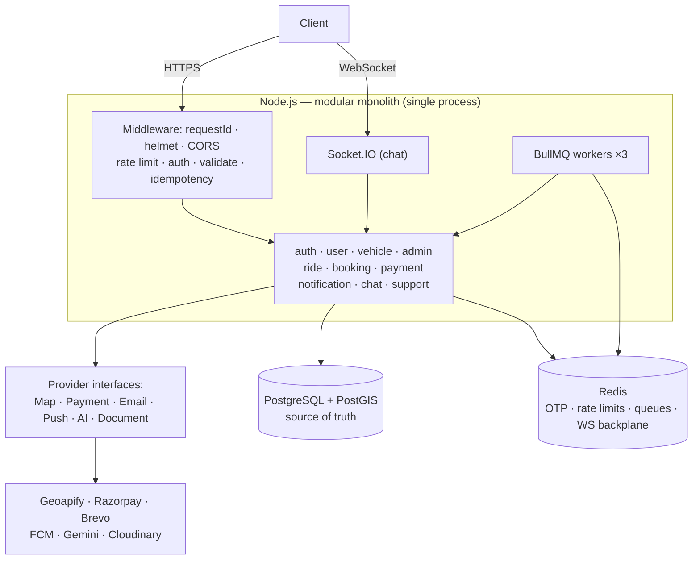

# Rydex Backend

India-focused carpooling backend — a production-oriented modular monolith in
TypeScript, built around geospatial ride matching, transaction-safe seat
allocation, and idempotent payments.

Part of the [Rydex](../README.md) monorepo. This is the only implemented
component today; see the root README for the overall repo layout.

## Overview

A driver publishes a trip they are already taking — origin, destination,
departure time, vehicle, seats. Passengers travelling the same corridor on the
same day search by **pickup point, drop point and date** (no time range) and book
individual seats.

This is not taxi dispatch. Nothing is hailed and nobody is dispatched, which
makes the matching problem the interesting part: given two coordinates and a
calendar date, find every ride whose route endpoints fall within ~10 km of both,
efficiently, at the database layer.

Four problems drive nearly every design decision in the codebase:

- **Geospatial matching** that stays in PostGIS instead of being loaded into
  Node and filtered there.
- **Seat allocation under concurrency** — two passengers hitting *book* on the
  last seat in the same millisecond must produce exactly one booking.
- **Money that must not move twice** — payments are confirmed by webhook, and
  webhooks get retried.
- **External providers that fail** — maps, payments, email, push and the LLM are
  all remote services with defined failure behaviour.

## Key engineering highlights

| Area | What's actually built |
|---|---|
| **Architecture** | Modular monolith — 10 domain modules with strict `routes → controllers → services → repositories` layering and service-to-service boundaries |
| **Geospatial search** | `geography(Point,4326)` columns, GiST indexes, `ST_DWithin` + `ST_Distance`, timezone-correct date ranges, keyset cursor pagination — one query, no map-provider call |
| **Seat concurrency** | A conditional `UPDATE` that is itself the row lock. Verified: 6 parallel processes, 1 seat → exactly 1 booking |
| **Payment idempotency** | Client `Idempotency-Key` arbitrated by a UNIQUE constraint; webhook transitions fire from exactly one source state, so duplicate delivery is a no-op |
| **Money correctness** | `Decimal(10,2)` everywhere, fares locked at booking time, commission computed in one place, refund + retained derived as complements |
| **Authentication** | Passwordless OTP (bcrypt-hashed in Redis), 15-minute stateless JWTs, 30-day opaque refresh tokens stored SHA-256-hashed, rotated on every use with family revocation on reuse |
| **Authorization** | Role gates where a capability is role-scoped; ownership checks in services everywhere else, returning 404 rather than 403 so resource existence never leaks |
| **Background work** | 3 BullMQ queues with bounded exponential retry; every handler idempotent; delayed seat-hold expiry |
| **Provider abstractions** | 6 capability interfaces (map, payment, email, push, AI, document storage) — two vendor swaps already done behind them |
| **AI support** | LLM chatbot with a tool layer whose schemas contain **no identity parameter** — `userId` is bound server-side, never taken from the model |
| **Real-time** | Socket.IO chat with a Redis adapter, authorized on every join *and* every send |
| **Reputation** | Bidirectional, role-scoped ratings whose running average is folded in by a single atomic `UPDATE` — verified lost-update-free under 8 simultaneous submissions |

## Architecture



**Detailed architecture: [`docs/architecture.md`](docs/architecture.md)** — modules,
database design, PostGIS, ride search, concurrency, payments, failure behaviour,
and the reasoning behind each decision.

## Core features

**Passenger** — OTP signup/login · search rides by pickup, drop and date with five
sort options and cursor pagination · book seats (10% prepayment) · cancel · chat
with the driver · rate the driver after the trip · in-app + push notifications ·
AI support chat.

**Driver** — everything above, plus: apply to become a driver by submitting a
driving licence · register vehicles and upload RC/insurance/pollution documents ·
create rides (5% posting commission) once a vehicle is admin-verified ·
start/complete/cancel rides with a policy-driven refund on cancellation · rate
passengers after the trip.

**Admin** — review and approve/reject driving-licence applications (approval
atomically promotes the user to `DRIVER`) and vehicle documents. Nothing else —
no user management, no ride overrides, no financial actions.

## Tech stack

| Layer | Technology |
|---|---|
| Runtime | Node.js 20, TypeScript 6 (strict), Express 5 |
| Database | PostgreSQL 16 + PostGIS 3.4, Prisma 7 (`@prisma/adapter-pg`) |
| Cache / ephemeral | Redis 7 (ioredis) |
| Queues | BullMQ 6 — `booking-expiry`, `refund`, `notification` |
| Real-time | Socket.IO 4 + `@socket.io/redis-adapter` |
| Validation | Zod 4 (bodies, queries, params, and env at startup) |
| Auth | jsonwebtoken (HS256), bcryptjs |
| Providers | Geoapify · Razorpay · Brevo · Firebase FCM · Google Gemini · Cloudinary |
| Tooling | ESLint 10, Prettier, tsx |

## Important backend flows

**Authentication.** `request-otp` generates a 6-digit code, bcrypt-hashes it into
Redis with a 5-minute TTL, and emails it. `verify-otp` compares, consumes the code
(single use), creates the account if new, and issues a 15-minute access token plus
a 30-day refresh token. Refresh tokens are opaque random bytes stored hashed and
rotated on every use — presenting an already-revoked one revokes the entire token
family.

**Ride search.** One PostGIS query. The requested date becomes a half-open UTC
range (Asia/Kolkata), two `ST_DWithin` calls do GiST-accelerated radius filtering
on origin and destination, `ST_Distance` computes exact distances only for
surviving rows, and results are keyset-paginated on an opaque cursor bound to the
chosen sort. The map provider is never called — it's for routing and geocoding,
not discovery.

**Booking.** The seat hold *is* the `PENDING_PAYMENT` booking row.
`available_seats` decrements at creation via a conditional `UPDATE` whose `WHERE`
clause doubles as the row lock, in the same transaction as the booking insert. A
losing concurrent request re-evaluates its guard against the committed value, gets
zero rows, and receives `409 NO_SEATS_AVAILABLE`. A delayed BullMQ job releases the
seat if payment never completes.

**Payment.** Order creation happens *outside* any transaction, then `Payment` and
`Transaction` rows are written together. The client's success callback is never
authoritative — a signature-verified webhook drives every state change, and each
transition fires from exactly one source state, so a retried webhook is a no-op.

**Notifications.** Nine business events enqueue a BullMQ job. The worker persists
the notification row (idempotent, keyed by an id minted at enqueue time), then
attempts FCM delivery separately — so a push failure can never prevent the in-app
record from existing.

**AI support.** The model can request one of four whitelisted tools. Their JSON
schemas contain no `userId` parameter at all; the executor binds it from the
authenticated session and calls the same ownership-checked service methods the REST
API uses. Whether a user may see a resource is never a question the model is asked.

## Security

Passwordless OTP with attempt caps and per-IP/per-email limits · bcrypt-hashed OTPs
· short-lived JWTs with a verified `type` claim · hashed, rotating refresh tokens
with reuse detection · role- and ownership-based authorization with 404-not-403 ·
Zod validation on every input including route params · parameterised SQL throughout
· magic-byte file validation with private, signed Cloudinary delivery · HMAC-SHA256
webhook verification over raw bytes · Redis-backed rate limiting across every
endpoint category · helmet, strict CORS, 1 MB body cap · and a production boot that
**refuses to start** on placeholder secrets, localhost CORS, `TRUST_PROXY=false`, or
missing payment/email credentials.


## Setup

```bash
cp .env.example .env       # fill in provider keys; console/stub fallbacks work without them
npm install
docker compose up -d       # PostgreSQL + PostGIS, Redis (development only)
npm run db:migrate         # apply migrations
npm run db:seed            # provision an ADMIN user
npm run dev                # tsx watch
```

| Script | Purpose |
|---|---|
| `npm run dev` | Run with hot reload |
| `npm run build` / `npm start` | Compile to `dist/` / run the build |
| `npm run typecheck` | Type-check without emitting |
| `npm run lint` / `lint:fix` | ESLint |
| `npm run format` / `format:check` | Prettier |
| `npm run db:migrate` / `db:migrate:deploy` | Migrations (dev / production) |
| `npm run db:generate` / `db:seed` / `db:studio` | Prisma client / seed / Studio |

Local development needs **no vendor accounts** — every provider falls back to a
console or stub implementation when unconfigured.

## Roadmap

| Phase | Status |
|---|---|
| 0–15 — implementation, verification, hardening | **Complete** |
| 16 — deployment (Render + Supabase + Upstash) | **Next** |
| 17 — end-to-end verification against the deployment | Blocked on 16 |

Deliberately **out of scope** — decisions, not omissions, each with its reasoning
in [`docs/steps.md`](docs/steps.md) §21: automated tests · structured logging ·
metrics and tracing · OpenAPI · DigiLocker document verification · SOS · live
ride tracking · wallet · coupons · support tickets · blocked users · audit log ·
monthly passes.

## Documentation

| File | Purpose |
|---|---|
| [`docs/architecture.md`](docs/architecture.md) | How Rydex is designed, and the reasoning behind each decision |
| [`docs/steps.md`](docs/steps.md) | How it was built — development progression, what each stage turned out to require, the dated decision log, and the roadmap |
| [`docs/claude.md`](docs/claude.md) | Engineering context: conventions, invariants, and traps to keep in mind when changing the code |
