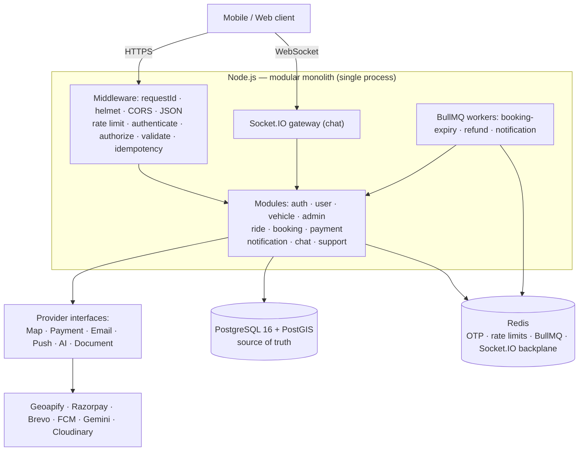
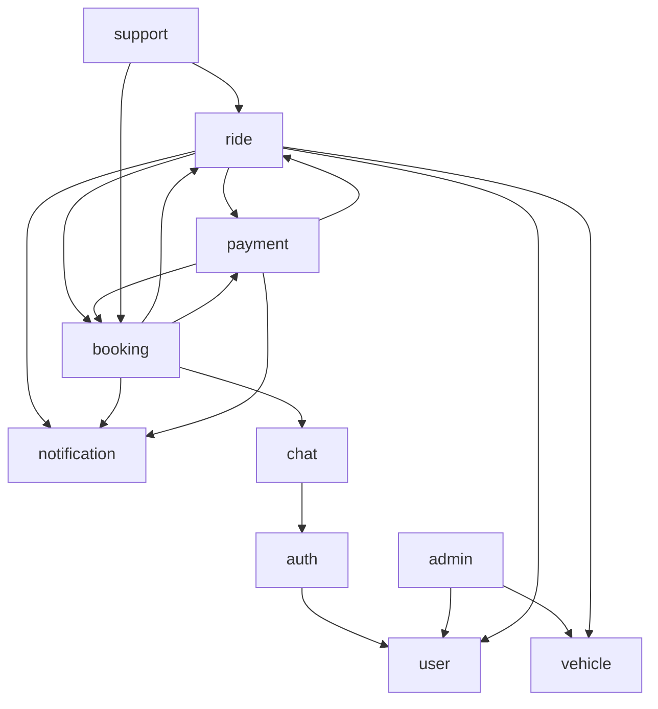
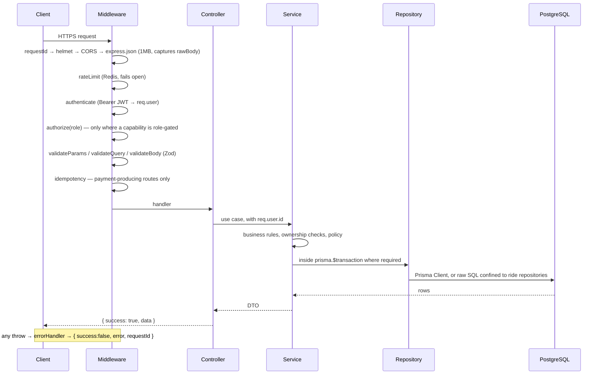
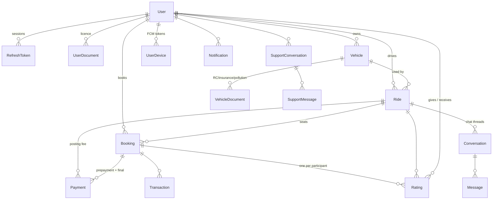
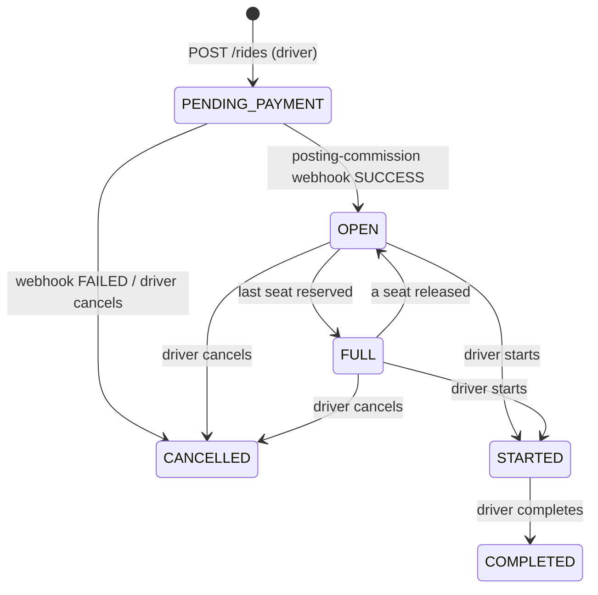
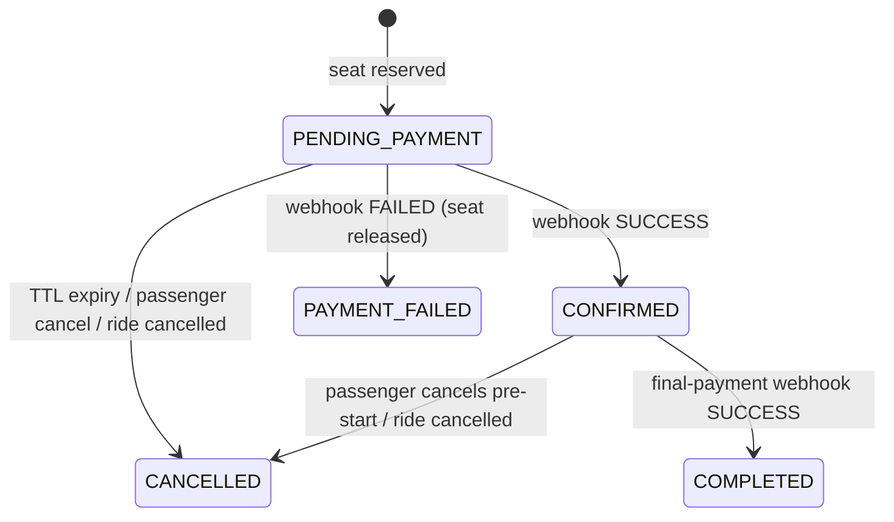
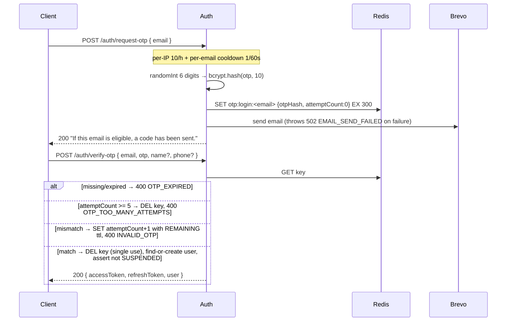
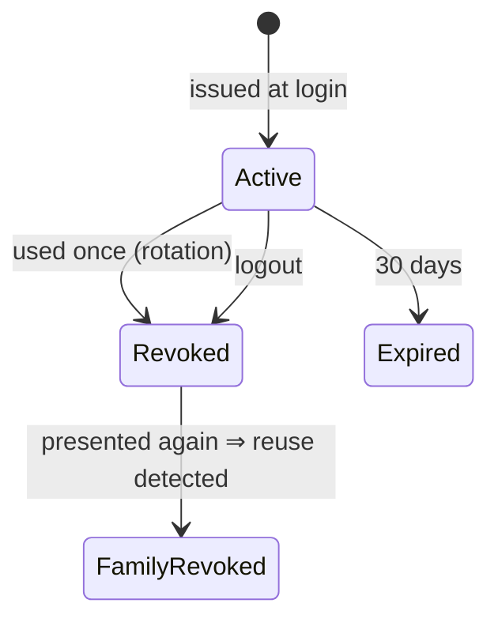
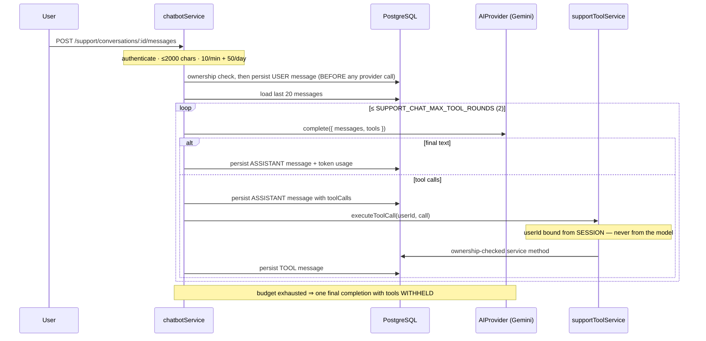
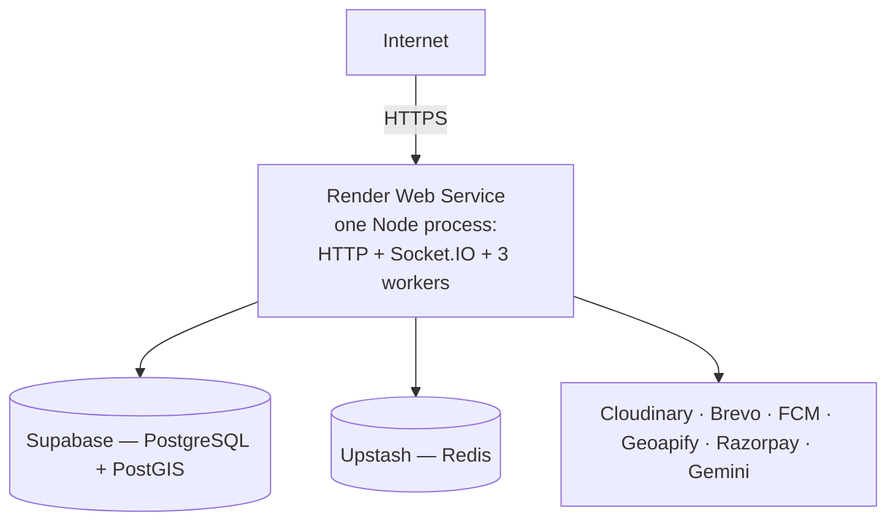

# Rydex Backend Architecture

Canonical technical architecture for the Rydex backend, describing the system
**as implemented** at the close of Phase 15.

| Document | Purpose |
|---|---|
| [`README.md`](../README.md) | Project overview |
| **`docs/architecture.md`** | How the backend works, and why (this file) |
| [`steps.md`](./steps.md) | How it was built — development progression, decision log, roadmap |
| [`claude.md`](./claude.md) | Engineering context: conventions, invariants, and traps |

**Honesty note.** Rydex has **no automated test suite**, **no structured
logger**, **no metrics or tracing**, and **is not currently deployed**. Those are
stated plainly in §17–§19 rather than glossed over.

---

## Contents

1. [System overview](#1-system-overview) · 2. [Architectural style](#2-architectural-style) ·
3. [Tech stack](#3-tech-stack) · 4. [Layers and request lifecycle](#4-layers-and-request-lifecycle) ·
5. [Modules](#5-modules) · 6. [Database](#6-database) · 7. [PostGIS](#7-postgis) ·
8. [Ride search](#8-ride-search) · 9. [Ride lifecycle](#9-ride-lifecycle) ·
10. [Booking and concurrency](#10-booking-and-concurrency) · 11. [Payments](#11-payments) ·
12. [Fare and commission](#12-fare-and-commission) · 13. [Authentication](#13-authentication) ·
14. [Authorization](#14-authorization) · 15. [Redis, BullMQ, notifications](#15-redis-bullmq-and-notifications) ·
16. [Provider abstractions](#16-provider-abstractions) · 17. [AI support](#17-ai-support) ·
18. [Security](#18-security) · 19. [Error handling](#19-error-handling) ·
20. [Failure behaviour](#20-failure-behaviour) · 21. [Deployment](#21-deployment) ·
22. [Scaling](#22-scaling) · 23. [Key decisions and trade-offs](#23-key-decisions-and-trade-offs) ·
24. [Known limitations](#24-known-limitations)

---

## 1. System overview

Rydex is an India-focused **carpooling backend**. A driver publishes a trip they
are already taking — origin, destination, departure time, vehicle, seats — and
passengers travelling the same corridor on the same day book individual seats.

It is not taxi dispatch. Nothing is hailed and nobody is dispatched. The matching
problem is different, and from a backend perspective more interesting: given a
pickup point, a drop point and a calendar date, find every ride whose *route
endpoints* fall within a radius of both — efficiently, at the database layer.

### Actors

| Actor | Role | Created by | Can do |
|---|---|---|---|
| Passenger | `PASSENGER` | Every signup lands here | Search, book, pay, cancel, chat, AI support |
| Driver | `DRIVER` | Admin approval of a driving licence | All of the above, plus register vehicles and create/start/complete/cancel rides |
| Admin | `ADMIN` | Seed script or manual insert — never self-registered | Review licences and vehicle documents. Nothing else |

One `users` table; `role` is a column on it.

### The four hard problems

1. **Geospatial matching at the database layer** — PostGIS + GiST, never
   application-side filtering (§7, §8).
2. **Seat allocation under concurrency** — a conditional `UPDATE` that is itself
   the lock (§10).
3. **Money that must not move twice** — every financial transition fires from
   exactly one source state, so duplicate webhooks are no-ops (§11).
4. **External providers that fail** — six interfaces, none called inside a
   transaction, each with defined failure behaviour (§16, §20).

### System diagram



Everything inside the API box is **one Node.js process**. The workers are
`Worker` instances constructed at startup in `src/server.ts`, not separate
deployments.

### Scope

Phases 0–15 complete: fully implemented and verified at runtime. Phase 16
(deployment) has not started, so **nothing is deployed**.

Deliberately out of scope — decisions rather than omissions, each with its
reasoning recorded in `steps.md` §21: automated tests, structured logging,
metrics and tracing, OpenAPI, DigiLocker document verification, SOS, live ride
tracking, wallets, coupons, support-ticket queues, blocked-user/report systems,
audit logs, monthly passes.

---

## 2. Architectural style

### Modular monolith — and why

One deployable process, one database, domain modules separated as strictly as if
they were services.

The target is ~10K users. At that scale the dominant risks are correctness and
money bugs, not throughput. A microservice split would have cost immediately:

- **Distributed transactions.** The most important invariant in the system is
  "seat decrement and booking insert commit together or not at all." In one
  database that is a two-statement transaction. Across a Ride service and a
  Booking service it becomes a saga with compensating actions — strictly harder,
  for nothing in return at this scale.
- **Operational surface.** Six pipelines, six credential sets, service discovery
  and inter-service auth, all before the first booking.
- **Premature boundaries.** Boundaries drawn before the domain is understood are
  usually wrong. Inside one codebase they cost a refactor; across a network they
  cost a migration.

What the monolith does *not* skip is discipline — the point of "modular" is that
extraction stays cheap if scale ever justifies it.

### Internal structure

```
src/modules/<name>/
├── routes.ts        HTTP wiring: path, middleware chain, controller
├── controllers/     parse → call service → format. No logic.
├── services/        use cases, business rules, transaction boundaries
├── repositories/    persistence only. No business rules.
├── schemas/         Zod validation + inferred types
├── strategies/      pluggable algorithms (fare only)
├── prompts/         LLM system prompt (support only)
└── socket/          Socket.IO handlers (chat only)
```

Dependency direction is one-way: **routes → controllers → services →
repositories**. A controller never touches Prisma. A repository never encodes a
business rule — it answers *how do I read/write this*, while the service answers
*what should happen*. Cross-module calls are service-to-service only.

`infrastructure/` never imports from `modules/`. The three worker files are the
apparent exception — they import their handler from the owning module, but they
are composition roots, the same role `server.ts` plays.

### Module dependency graph



Two observations worth being able to defend:

- **`ride ↔ booking ↔ payment` are mutually dependent.** Cancellation cascades
  into bookings and refunds; booking reserves a seat on a ride; the webhook
  transitions both. These three are one bounded context — the trip lifecycle —
  and would be extracted together or not at all.
- **Everything else is a leaf.** `notification`, `support`, `chat`, `admin`,
  `vehicle` are consumed but consume little. Those are the cheap extractions.

**What I'd extract first:** Notification. It is already fully asynchronous behind
a queue, so extraction means pointing the producer at a remote queue — nothing
upstream changes. Then Support, then Chat. The trip core last, or never.

---

## 3. Tech stack

| Technology | Used for | Why |
|---|---|---|
| Node.js 20 + TypeScript 6 (strict) | Runtime, type safety | I/O-bound API; strict mode throughout, `unknown` + narrowing over `any` |
| Express 5 | HTTP layer | Minimal middleware model; async error propagation removes the need for a `catchAsync` wrapper |
| PostgreSQL 16 | **Source of truth** | Transactions, row locking, foreign keys and unique constraints are what make the seat and money invariants enforceable rather than hoped-for |
| PostGIS 3.4 | Geospatial storage and search | Correct spherical distance in metres, GiST-indexed radius queries |
| Prisma 7 + `@prisma/adapter-pg` | ORM, migrations | Type-safe queries and migration history; geography columns handled via isolated raw SQL |
| Redis 7 (ioredis) | OTP, rate limits, BullMQ, Socket.IO backplane | Ephemeral, TTL-native, shared across instances. Never authoritative |
| BullMQ 6 | 3 queues: booking-expiry, refund, notification | Durable **delayed** jobs with bounded retry — seat-hold expiry has no synchronous equivalent |
| Socket.IO 4 + Redis adapter | Driver↔passenger chat | Reconnection handling; the adapter makes it horizontally scalable without changing handler code |
| Zod 4 | Every body, query, param, and env validation | One validation library, schemas double as types |
| jsonwebtoken / bcryptjs | Access tokens / OTP hashing | — |
| helmet, cors, multer | Headers, origin allowlist, uploads | — |
| ESLint 10 + Prettier | Lint, format | — |

**Not present:** test framework, structured logger, OpenAPI generation,
Dockerfile, CI pipeline. `docker-compose.yml` is **development infrastructure
only** (Postgres + Redis).

### External providers

| Provider | Interface | Fallback when unconfigured |
|---|---|---|
| Geoapify | `MapProvider` | none — required at boot |
| Razorpay | `PaymentProvider` | `StubPaymentProvider` (real HMAC webhook verification, fake order ids) |
| Brevo | `EmailProvider` | `ConsoleEmailProvider` (OTP to stdout) |
| Firebase FCM | `PushProvider` | `ConsolePushProvider` |
| Google Gemini | `AIProvider` | `ConsoleAIProvider` |
| Cloudinary | `DocumentProvider` | none — required at boot |

Production boot **refuses to start** without Brevo and Razorpay credentials —
those two fallbacks are actively unsafe rather than merely degraded (OTPs in
logs; real bookings against a gateway that moves no money). FCM and Gemini
degrade a feature, so they warn loudly instead.

---

## 4. Layers and request lifecycle



### Where responsibility sits

| Concern | Where | Note |
|---|---|---|
| Request correlation | `requestId` | Honours inbound `X-Request-Id`, else mints `req_<uuid>`; echoed on the response and in every error body |
| Raw body capture | `express.json({ verify })` | Webhook signatures are computed over the exact bytes received, not a re-serialized string |
| Rate limiting | `rateLimit()` factory | Placed **before** validation and idempotency so a request destined for rejection does the least work |
| Authentication | `authenticate` | Verifies signature *and* the `type: 'access'` claim |
| Coarse authorization | `authorize(...roles)` | Only `POST /rides`, `POST /vehicles`, all of `/admin` |
| Fine authorization | Service layer | Ownership checks live with the data (§14) |
| Validation | `validateBody/Query/Params` | Express 5 makes `req.query` getter-only, so coerced query lands on `req.validatedQuery` |
| Idempotency | `idempotency(endpoint)` | Only the two routes that create payment orders |
| Transactions | Services only | Repositories accept a `Prisma.TransactionClient` |
| Error → HTTP | `errorHandler` | The only place a failure gets a status code |

### Ordering choices worth defending

- **Rate limit before validation** — rejecting a flood should be cheap.
  Idempotency costs a database round trip, so it goes last.
- **Idempotency after validation** — a request that fails validation had no side
  effect and must not burn a key.
- **Upload limit before multer** — so an oversized-upload flood is rejected
  before bodies are buffered into memory.

### Response shapes

```jsonc
{ "success": true,  "data": { } }
{ "success": true,  "data": { "items": [], "nextCursor": "eyJ..." } }
{ "success": false, "error": { "code": "RIDE_NOT_FOUND", "message": "Ride not found" },
  "requestId": "req_5f1c..." }
```

---

## 5. Modules

### Endpoint map

```
GET   /health · /ready

POST  /api/v1/auth/request-otp · verify-otp · refresh · logout

GET   /api/v1/users/me                      PATCH /api/v1/users/me
POST  /api/v1/users/me/driver-application   POST  /api/v1/users/me/devices

GET   /api/v1/admin/driver-applications
POST  /api/v1/admin/driver-applications/:userId/verify · reject
GET   /api/v1/admin/vehicles · /:id
POST  /api/v1/admin/vehicles/:id/verify · reject

POST  /api/v1/vehicles          GET /api/v1/vehicles      GET/PATCH /api/v1/vehicles/:id
POST  /api/v1/vehicles/:id/documents

GET   /api/v1/places/autocomplete

POST  /api/v1/rides             GET /api/v1/rides/search  GET /api/v1/rides/:id
GET   /api/v1/rides/mine        GET /api/v1/rides/:id/bookings
POST  /api/v1/rides/:id/cancel · start · complete
POST  /api/v1/rides/:id/bookings

GET   /api/v1/bookings          GET /api/v1/bookings/:id
POST  /api/v1/bookings/:id/cancel
GET   /api/v1/bookings/:id/ratings              POST /api/v1/bookings/:id/ratings

GET   /api/v1/conversations     GET /api/v1/conversations/:id/messages
GET   /api/v1/notifications     PATCH /api/v1/notifications/:id/read

POST  /api/v1/webhooks/payment          (public, signature-verified)

POST  /api/v1/support/conversations     GET /api/v1/support/conversations
GET   /api/v1/support/conversations/:id POST /api/v1/support/conversations/:id/messages
```

There is **no** `POST /api/v1/payments/...` endpoint — payment orders are a side
effect of ride creation, booking creation and ride completion. The payment
module's only HTTP surface is the webhook.

### Module responsibilities

| Module | Owns | Key services | Notes |
|---|---|---|---|
| **auth** | `RefreshToken` | `authService`, `otpService`, `tokenService` | No passwords. OTP → tokens (§13) |
| **user** | `User`, `UserDocument` | `userService`, `driverApplicationService` | No self-promotion to `DRIVER` |
| **vehicle** | `Vehicle`, `VehicleDocument` | `vehicleService` | Only `POST /vehicles` is role-gated; the rest is ownership-scoped |
| **admin** | — (decides *about* User/Vehicle) | `adminVehicleService`, `adminDriverApplicationService` | Whole router gated `authorize('ADMIN')`. Two workflows only |
| **ride** | `Ride` | `rideService`, `rideSearchService`, `fareService`, `commissionService`, `cancellationPolicyService`, `vehicleEligibilityService` | The core domain |
| **booking** | `Booking` | `bookingService`, `bookingExpiryService`, `finalPaymentService`, `settlementService` | Seat allocation (§10) |
| **payment** | `Payment`, `Transaction`, `IdempotencyKey` | `webhookService`, `paymentRecordService`, `idempotencyService`, `refundService` | All money transitions converge in `webhookService` |
| **notification** | `Notification`, `UserDevice` | `notificationService` | 9 producers + the worker handler |
| **chat** | `Conversation`, `Message` | `conversationService` | One conversation per `(rideId, passengerId)`. Send over WS only; REST is read-only history |
| **support** | `SupportConversation`, `SupportMessage` | `chatbotService`, `supportToolService` | Entirely separate from `chat` (§17) |
| **rating** | `Rating` | `ratingService` | Bidirectional, role-scoped reputation. Routed under `bookings/:id` (§9) |

Two placement notes: `POST /users/me/devices` is routed on the user router but
implemented by the notification module (the resource is the user's device, the
logic belongs to notifications). `POST /rides/:id/bookings` is registered on the
ride router but implemented by the booking module (the spec nests booking
creation under the ride resource).

**Ride eligibility** is decided in exactly one function,
`assertVehicleEligibleForRide`: ownership **+** `status = ACTIVE` **+**
`verificationStatus = VERIFIED` **+** seat capacity ≥ requested. It is
deliberately not duplicated anywhere.

---

## 6. Database

PostgreSQL is authoritative for every durable entity. Redis holds nothing whose
loss would corrupt domain state.



17 models, 18 enums, 10 migrations.

### Design decisions

**UUID primary keys everywhere.** Sequential integers would let anyone enumerate
rides, bookings and users by incrementing a path segment.

**`Decimal(10,2)` for every monetary column.** Floats cannot represent ₹0.10
exactly, and money off by a paisa surfaces months later in reconciliation.
Repositories convert `Prisma.Decimal` → `number` at the mapping boundary and
business math is `Math.round`-ed to whole rupees.

**`Timestamptz(3)` everywhere.** Wall-clock time without an offset makes the
Asia/Kolkata date-range search impossible to get right.

**One `status` column per lifecycle, not two.** `Booking` has a single `status`
covering `PENDING_PAYMENT / CONFIRMED / PAYMENT_FAILED / CANCELLED / COMPLETED`
rather than separate booking + payment status columns — those five values are one
state machine describing one lifecycle. Gateway-level detail lives on the
`Payment` row's own `status`. `Ride` follows the identical pattern.

**Reputation is role-scoped, and a nullable average means "unrated" rather than
"bad".** `driver_rating_*` and `passenger_rating_*` are separate pairs: a single
average cannot mean both "good driver" and "good passenger", and the fare
multiplier and `DRIVER_RATING` sort must read the driver figure specifically.
Search sorting uses `COALESCE(driver_rating_average, 6)` so unrated drivers sort
last without introducing NULLs into the keyset comparison.

**No soft deletion.** Entities reach terminal *statuses*. `UserDevice` is the one
exception — FCM-invalidated tokens are genuinely removed.

**Cascade policy chosen per relation:** `Ride → Vehicle` is `Restrict` (a vehicle
with ride history can't be deleted out from under it); `Payment`/`Transaction` →
`Booking`/`Ride` is `SetNull` (financial history outlives what it refers to);
`User → verifiedVehicles` is `SetNull` (removing an admin must not delete the
vehicles they approved); everything else cascades.

### Load-bearing constraints

| Constraint | Enforces |
|---|---|
| `users.email` / `users.phone` UNIQUE | Identity uniqueness in the database, not an application pre-check that races |
| `vehicles.registration_number` UNIQUE | One vehicle, one registration |
| `refresh_tokens.token_hash` UNIQUE | Duplicate inserts impossible |
| `payments.provider_order_id` UNIQUE | The webhook's lookup key is unambiguous |
| `idempotency_keys (user_id, key)` UNIQUE | **This is the idempotency mechanism**, not merely an index (§11) |
| `conversations (ride_id, passenger_id)` UNIQUE | Lazy conversation creation is naturally idempotent |
| `user_devices.device_token` UNIQUE | A physical device has one owner; a new login reassigns it |

The last four are relied on by application code to let the *database* arbitrate
races, rather than checking first and hoping.

### Indexes (27 total)

```
users(email)U  users(phone)U  vehicles(registration_number)U  vehicles(owner_id)
refresh_tokens(token_hash)U  refresh_tokens(user_id)
user_documents(user_id)  vehicle_documents(vehicle_id)
rides(driver_id)  rides(vehicle_id)  rides(departure_time, status)
rides USING GIST(origin)  rides USING GIST(destination)
bookings(ride_id)  bookings(passenger_id)
payments(provider_order_id)U  payments(booking_id)  payments(provider_payment_id)
transactions(booking_id)  idempotency_keys(user_id, key)U
user_devices(device_token)U  user_devices(user_id)
notifications(user_id, created_at)  messages(conversation_id, created_at)
conversations(ride_id, passenger_id)U
support_conversations(user_id, last_message_at)
support_messages(conversation_id, created_at)
```

The composite indexes are shaped for keyset pagination — `(user_id, created_at)`
and `(conversation_id, created_at)` let the cursor's tuple comparison walk the
index directly.

### Transaction boundaries

Short, containing **no external network calls**, never wrapping a whole request.

| Transaction | Contents |
|---|---|
| Seat reservation | conditional seat UPDATE + booking INSERT |
| Ride creation | ride INSERT + `Payment` + `Transaction` INSERT |
| Payment-order follow-up | set order id + `Payment`/`Transaction` INSERT |
| Webhook resolution | resolve `Payment` + `Transaction` + ride/booking transition + refund intent |
| Driver cancellation | ride CANCEL + every booking CANCEL + seat releases + refund intents |
| Refresh rotation | lookup + revoke + insert replacement |
| Booking cancellation | ride-status re-read + booking CANCEL + seat release |

The pattern for anything involving a provider is always:
**external call → `BEGIN` … internal writes only … `COMMIT` → enqueue async work.**

---

## 7. PostGIS

```prisma
model Ride {
  origin      Unsupported("geography(Point,4326)")
  destination Unsupported("geography(Point,4326)")
}
```

**`geography`, not `geometry`.** With `geography`, PostGIS computes distance on a
spheroid and returns **metres**. With `geometry` at SRID 4326 it returns
*degrees* — meaningless as a radius and wrong by a latitude-dependent factor. For
radius search over Indian cities that is the difference between correct and
silently wrong.

**SRID 4326** is WGS-84 — what GPS and every mapping API speak — so no
reprojection is ever needed.

**`Unsupported(...)`** is Prisma's escape hatch: it preserves the column through
migrations but generates no client accessor. Consequences, all handled:

- Writes and coordinate reads go through raw SQL confined to `rideRepository`.
- Reads that don't need coordinates (`findStatusById`, `findRecentByDriverId`)
  use ordinary Prisma `select` and omit those columns.
- **Prisma's diff engine periodically proposes dropping the hand-written GiST
  indexes**, because it has no record they should exist. This has happened twice
  and once left both indexes actually missing. Mitigated by a standing rule:
  always `prisma migrate dev --create-only`, inspect the SQL, strip the
  `DROP INDEX` statements.

### Storage and retrieval

```sql
-- write
ST_SetSRID(ST_MakePoint($lng, $lat), 4326)::geography
-- read
ST_Y(origin::geometry) AS origin_lat, ST_X(origin::geometry) AS origin_lng
```

Longitude comes **first** in `ST_MakePoint` — the most common PostGIS mistake,
and it would silently place every Indian ride in the Indian Ocean. The repository
is the only place it appears.

### Spatial indexes

```sql
CREATE INDEX rides_origin_gist      ON rides USING GIST (origin);
CREATE INDEX rides_destination_gist ON rides USING GIST (destination);
```

GiST stores bounding boxes in an R-tree. `ST_DWithin` is index-aware: the planner
discards the vast majority of rows by bounding box before computing any exact
distance. `EXPLAIN ANALYZE` was used in Phase 15 to confirm both are actually
chosen — an index that exists but is never used is worse than none.

### Why filtering happens in the database

The alternative — fetch by date, then Haversine in Node — fails four ways:

1. **Volume.** Every ride for a date crosses the wire and is materialised in the
   Node heap to discard ~99% of it.
2. **No index can help.** JavaScript filtering is O(n) over the fetched set; GiST
   is sublinear.
3. **Pagination breaks.** Cursor pagination needs `LIMIT` applied *after*
   filtering and sorting. Filtering afterwards means fetching everything on every
   page.
4. **Accuracy.** Hand-rolled Haversine is a spherical approximation; `geography`
   distance on the WGS-84 spheroid is exact and free.

The same reasoning rules out calling the map provider per result: a 20-result
page would mean 40 distance-matrix calls, adding hundreds of milliseconds and
burning a metered quota to answer a question the database already answered.
**The map provider is for routing and geocoding; it is never in the search path.**

---

## 8. Ride search

> The interview section.

A passenger supplies **date, pickup point, drop point** — no time range. All
rides departing on that calendar date whose origin is within ~10 km of pickup and
destination within ~10 km of drop are matches; the passenger chooses the sort.

```
GET /api/v1/rides/search?date=2026-08-20
  &pickupLat=28.6139&pickupLng=77.2090
  &destinationLat=28.4595&destinationLng=77.0266
  &sort=DEPARTURE_TIME&limit=20&cursor=<opaque>
```

### The query

```sql
SELECT r.id, r.departure_time, r.available_seats, r.fare_per_seat,
       ST_Distance(r.origin,      $pickup)      AS pickup_distance_meters,
       ST_Distance(r.destination, $destination) AS destination_distance_meters,
       u.id, u.name, u.driver_rating_average, v.vehicle_type, v.model, v.is_ac
FROM rides r
JOIN vehicles v ON v.id = r.vehicle_id
JOIN users    u ON u.id = r.driver_id
WHERE r.departure_time >= $dayStart
  AND r.departure_time <  $dayEnd
  AND r.status IN ('OPEN','FULL')
  AND r.available_seats > 0
  AND ST_DWithin(r.origin,      $pickup,      $originRadius)
  AND ST_DWithin(r.destination, $destination, $destinationRadius)
  AND ($sortExpr, r.id) > ($cursorValue::<type>, $cursorId::uuid)   -- pages ≥ 2
ORDER BY $sortExpr ASC, r.id ASC
LIMIT $limit
```

Every `$…` is a parameter placeholder. `$sortExpr` is **not** — it is one of five
compile-time constants selected by a `switch` on a validated enum. That
distinction is the entire SQL-injection story for this endpoint.

### Why it is cheap

1. **Date range** — served by `rides(departure_time, status)`, by far the most
   selective filter (one day out of all rides).
2. **Status** — same composite index. `PENDING_PAYMENT` rides, whose posting
   commission hasn't been confirmed, are never discoverable.
3. **`available_seats > 0`** — authoritative. `FULL` alone is not sufficient
   evidence of unavailability; the seat count decides.
4. **Two `ST_DWithin`** — GiST bounding-box scans on the already-narrowed set.
5. **`ST_Distance`** runs only on surviving rows, in the projection.

### Sorting — safe by construction

| Enum | SQL |
|---|---|
| `DEPARTURE_TIME` (default) | `r.departure_time` |
| `PICKUP_DISTANCE` | `ST_Distance(r.origin, $pickup)` |
| `DESTINATION_DISTANCE` | `ST_Distance(r.destination, $destination)` |
| `FARE` | `r.fare_per_seat` |
| `DRIVER_RATING` | `COALESCE(u.driver_rating_average, 6)` |

Every sort ends `, r.id ASC`. Without a unique tie-breaker, two rides departing
at the same instant have no defined relative order and keyset pagination can skip
or repeat rows. The `6` sentinel sits just above the 1–5 range so unrated drivers
sort last, while keeping NULLs out of the comparison tuple — `(a,b) > (NULL,c)`
is not a total order.

### Cursor pagination

Offset pagination is wrong here: `OFFSET 10000` makes Postgres produce and
discard 10,000 rows, and any insert between pages shifts every subsequent row.

Keyset instead — `base64url(JSON.stringify({ sort, value, id }))`:

- **Opaque** — no SQL, no internal query state.
- **Sort-bound** — a cursor minted for `FARE` is rejected with
  `400 INVALID_CURSOR` if replayed against `DEPARTURE_TIME`, because the keyset
  comparison depends on the exact sorted field.
- **Typed** — `::timestamptz` / `::double precision` / `::numeric` appended so the
  comparison matches the expression's SQL type.
- **`limit + 1`** — fetching one extra row reveals whether a next page exists
  without a second `COUNT(*)`.

### Timezone handling

Never `WHERE DATE(departure_time) = $date` — that applies a function to the
indexed column, discarding the index, and silently uses the server's timezone.
Instead:

```ts
const start = new Date(`${dateStr}T00:00:00+05:30`);
const end   = new Date(start.getTime() + 86_400_000);
```

India has used a fixed UTC+05:30 offset with no DST since 1945, so the hardcoded
offset is correct rather than a shortcut. The half-open interval avoids
double-counting a ride departing exactly at midnight.

### Condensed answer

> Search is one PostGIS query. The date becomes a half-open UTC range so the
> `(departure_time, status)` index applies; two `ST_DWithin` calls do
> index-accelerated radius filtering on `geography(Point,4326)` columns with GiST
> indexes; `ST_Distance` computes exact spheroid distances only for surviving
> rows. Sorting maps a validated enum to one of five fixed SQL expressions with
> `id` as tie-breaker, and pagination is keyset-based on an opaque cursor bound to
> the sort order. The map provider is never called.

---

## 9. Ride lifecycle



**Why `PENDING_PAYMENT` exists.** A ride costs its driver a 5% posting
commission, confirmed asynchronously by webhook. A ride cannot become searchable
inside the same request that created it, because at that moment no money has been
confirmed. Search excludes it.

**Creation flow** — every external call happens *before* the single database
write: eligibility check → `MapProvider.getRoute()` → fare → commission →
`PaymentProvider.createOrder()` → one transaction inserting the ride plus its
`Payment`/`Transaction` rows.

**`OPEN ⇄ FULL` is not a separate statement** — it rides along inside the seat
reservation/release `UPDATE`, so seat count and ride status can never disagree.

**Invalid transitions.** Every mutator is a conditional `updateMany` whose
`WHERE` enumerates the legal source states. If the row isn't in one, `count === 0`
and the service throws `409 INVALID_RIDE_STATE` with nothing written.

**Cancellation cascade** (one transaction): cancel the ride → find every
`PENDING_PAYMENT`/`CONFIRMED` booking → cancel each, **branching on its own return
value** rather than the snapshot (a passenger may have self-cancelled
concurrently) → release its seats → for `CONFIRMED`, insert a `PENDING` `REFUND`
transaction for the full prepayment → apply the driver's commission-refund policy.
After commit: enqueue refund jobs, cancel scheduled expiry jobs, notify.

**Completion** flips `STARTED → COMPLETED`, notifies passengers, then creates the
remaining-90% order per `CONFIRMED` booking. Order creation is wrapped per booking
in `Promise.allSettled` + `try/catch` — one booking's provider failure must not
block the others or retract the ride's completion.

---

## 10. Booking and concurrency

### The seat hold *is* the booking row

`available_seats` decrements at **booking creation**, not at payment
confirmation. There is no Redis seat counter and no separate reservation table. A
`PENDING_PAYMENT` booking row plus the decrement that created it **is** the hold;
a delayed BullMQ job releases it if payment never completes.

Holding at payment confirmation would be simpler but lets two passengers both
reach a payment screen for the same last seat — converting a clean `409` into a
refund.

### Two passengers, one seat

**The conditional UPDATE is itself the lock.**

```sql
UPDATE rides
SET available_seats = available_seats - $n,
    status = CASE WHEN available_seats - $n = 0 THEN 'FULL'::ride_status ELSE status END
WHERE id = $rideId
  AND status IN ('OPEN','FULL')
  AND available_seats >= $n
RETURNING fare_per_seat, driver_id
```

PostgreSQL takes a row-level exclusive lock for the statement's duration. Under
the default READ COMMITTED isolation, a concurrent `UPDATE` on the same row
**blocks**, then re-evaluates its `WHERE` against the *committed* value.

| | Transaction A | Transaction B |
|---|---|---|
| t₁ | `UPDATE` → locks row, seats 1 → 0, status → `FULL` | |
| t₂ | | `UPDATE` → **blocks on A's lock** |
| t₃ | `INSERT booking` | *(blocked)* |
| t₄ | `COMMIT` | |
| t₅ | | lock released; re-evaluates `available_seats >= 1` against **0** ⇒ **0 rows** |
| t₆ | | `null` → `409 NO_SEATS_AVAILABLE` → rollback |

Exactly one booking. `available_seats` cannot go negative because the guard is
evaluated atomically with the decrement — there is no read-then-write window.

This is why the code uses `UPDATE … WHERE … RETURNING` rather than `SELECT … FOR
UPDATE` then check then update. Both are correct; one statement is fewer round
trips and cannot be written incorrectly by forgetting the lock.

**Verified:** 6 parallel OS processes against a 1-seat ride → exactly 1 success,
5 × `409`, `available_seats = 0`, ride `FULL`, no negative count.

### The pattern generalises

Every state mutator in the system has one shape:

```ts
const result = await db.<model>.updateMany({
  where: { id, status: { in: ALLOWED_SOURCE_STATES } },
  data:  { status: NEW_STATE },
});
return result.count === 1;   // false ⇒ someone else already moved it
```

Applied to ride cancel/start/complete/confirm/fail, booking
cancel/expire/confirm/fail/complete, payment resolution, transaction resolution,
admin vehicle verify/reject, admin driver-application verify/reject. Callers
branch on the boolean, never on a prior read.

### Booking states



### Seat-hold expiry

Scheduled at creation with `delay = BOOKING_PAYMENT_TTL_SECONDS` (900) and
`jobId = bookingId`, which makes rescheduling a no-op rather than a duplicate job.
The handler is idempotent by construction — `expireIfPending` only fires from
`PENDING_PAYMENT`, so if the booking was confirmed meanwhile, nothing matches and
no seat is released. The job is safe to run any number of times.

It is *also* cancelled proactively on any terminal transition. That changes no
behaviour — the no-op path already handled it — it just avoids wasted work.

### Cancellation guard

`cancelBooking` re-reads the ride's status **inside** the transaction. Reading it
before would leave a TOCTOU window in which the driver starts the ride between
check and cancel, letting a passenger dodge the final 90% payment.

### Fare locking

`farePerSeat`, `totalFare` and `prepaidAmount` are copied onto the booking at
creation from the ride's persisted fare. Nothing recalculates them. Changing
`FARE_PRICE_PER_KM` tomorrow cannot alter what an existing booking owes.

### Concurrency scenario matrix

| Scenario | Mechanism | Verified |
|---|---|---|
| Two passengers, last seat | Conditional UPDATE with seat guard | ✅ 6 parallel processes |
| Duplicate booking/ride request | `IdempotencyKey` UNIQUE + response replay | ✅ 4 concurrent, same key |
| Duplicate payment webhook | `Payment.status` only transitions from `CREATED` | ✅ 8 concurrent deliveries |
| Duplicate refund job | `jobId` dedupe + `PENDING`-only + pre-provider status re-read | ✅ 3× concurrent |
| Refresh-token reuse | Transactional lookup-and-revoke on a unique hash | ✅ 5 concurrent rotations |
| Driver cancels during booking | Both take the ride row lock; cascade branches per booking | ✅ same-tick dispatch |
| Webhook succeeds after TTL expiry | `confirmPayment` returns false → refund transaction | ✅ forced race |
| Concurrent ratings for one user | Average recomputed **inside** the `UPDATE`, never read-modify-write | ✅ 8 simultaneous; stored average matched a recomputed `AVG()` exactly |
| Duplicate rating submission | `(booking_id, rater_id)` UNIQUE, in the same tx as the aggregate | ✅ rejected `409`, aggregate unmoved |

**The subtlest case.** A payment captured *after* the TTL expired: the money
genuinely moved, so `Payment`/`Transaction` are correctly `SUCCESS`, but
`confirmPayment` matches nothing. Rather than log-and-forget, the webhook detects
`applied === false` and creates a `REFUND` transaction for the full captured
amount. It cannot double-refund against the cancellation cascade — each path is
gated by its own conditional-update outcome, verified by forcing the race.

**Not guaranteed:** cross-service consistency with the gateway is eventual. If
the process dies after `createOrder()` returns but before the follow-up commit, an
orphan order exists at Razorpay with no local `Payment`. The webhook answers
`404`, Razorpay retries, and it resolves if the write landed; otherwise the order
expires unpaid. No money moves either way.

No `SERIALIZABLE` isolation is used anywhere — every invariant is expressible as
a single-statement conditional update or a unique constraint, which is cheaper
and needs no retry-on-serialization-failure loop.

### Ratings — the same two mechanisms, applied to an aggregate

Reputation is **bidirectional and role-scoped**: a passenger rates the driver,
the driver rates the passenger, and the two live in separate column pairs
(`driver_rating_*`, `passenger_rating_*`). A single blended average would be
wrong, because the fare multiplier and the `DRIVER_RATING` sort both read the
*driver* figure — mixing in someone's conduct as a passenger would price rides
on the wrong signal.

**One endpoint serves both directions**, because the direction is derived rather
than declared:

```
POST /api/v1/bookings/:id/ratings   { score, comment? }

caller === booking.passengerId  →  ratee = ride.driverId,       role = DRIVER
caller === ride.driverId        →  ratee = booking.passengerId, role = PASSENGER
otherwise                       →  404  (never 403 — don't confirm the booking exists)
```

The request body carries a score and nothing else. There is no `rateeId` field
to spoof, which is the same reasoning that keeps identity out of the AI tool
schemas (§17).

Ratings hang off the **booking**, not the ride, because a booking is exactly the
unit through which two people shared a trip — which is what makes "one rating per
participant per trip" expressible as `UNIQUE (booking_id, rater_id)`.

**Eligibility gates on `ride.status = COMPLETED`, deliberately not on the
booking.** A booking only reaches `COMPLETED` when its final-payment webhook
succeeds, and no reconciliation job exists to recover a payment whose webhook
never arrived (§24) — gating on the booking would let a payment failure make a
trip permanently unrateable for a passenger who did nothing wrong.

#### The aggregate must not be read-modify-write

`users.driver_rating_average` is denormalised because the fare path reads it
synchronously during ride creation; recomputing an `AVG()` there would put an
aggregate query on a hot path. Maintaining it naively — read the average, compute
the new one in Node, write it back — is a textbook lost update: two passengers
rating the same driver at once, and one score vanishes.

Instead the new average is computed **inside** the statement, so the row lock the
`UPDATE` already takes covers the read as well:

```sql
UPDATE users
SET driver_rating_average = ROUND(
      ((COALESCE(driver_rating_average, 0) * driver_rating_count) + $score)
      / (driver_rating_count + 1), 2),
    driver_rating_count = driver_rating_count + 1
WHERE id = $rateeId
```

Same shape as `reserveSeats` (§10). The column names vary by role and cannot be
parameterised, so they are selected by a `switch` over the validated enum and
emitted as compile-time constants — the identical discipline the search sort uses
to keep a dynamic-looking query free of anything client-supplied.

The insert and the aggregate share one transaction, so a duplicate rejected by
the unique constraint rolls back the average with it and can never double-count.

**Verified:** eight simultaneous ratings against one driver produced a stored
average that matched a freshly recomputed `AVG()` exactly, with no lost updates.

Unlike the payment endpoints, a repeat submission is **rejected** (`409
ALREADY_RATED`) rather than replayed. An idempotency key exists so a retried
*side effect* happens once; a rating is a one-time opinion, and silently
returning the original would hide that a second, different score was discarded.
Ratings are immutable — no update or delete path exists.

---

## 11. Payments

### Money model

| Charge | Payer | When | Amount |
|---|---|---|---|
| Posting commission | Driver | Ride creation | 5% of `farePerSeat × totalSeats` |
| Prepayment | Passenger | Booking creation | 10% of `totalFare` |
| Final payment | Passenger | Ride completion | remaining 90% |
| Platform commission | — | On completion | 3% of `totalFare`; driver gets 97% |

### Two record types, always created together

**`Payment`** — a gateway attempt: provider, order id, payment id, amount,
`CREATED → SUCCESS|FAILED`.
**`Transaction`** — a business record: type (`DRIVER_RIDE_FEE` /
`BOOKING_PREPAYMENT` / `FINAL_PAYMENT` / `REFUND`), amount, `PENDING →
SUCCESS|FAILED`.

Both are written by `paymentRecordService.recordOrder` and resolved by
`resolvePaymentByOrderId` — one call site each, so they cannot drift. Failed
attempts get a financial record too, which is what makes `transactions` a
reconciliation history rather than a success log.

### Lifecycle

```mermaid
sequenceDiagram
    participant App as Rydex
    participant RZP as Razorpay
    participant C as Client
    participant WH as Webhook handler
    participant DB as PostgreSQL

    App->>RZP: createOrder(amount, receipt)
    RZP-->>App: order_xxx
    App->>DB: INSERT Payment(CREATED) + Transaction(PENDING)
    App-->>C: { entity, paymentOrder }
    C->>RZP: pays via checkout
    Note over C,App: the client's "success" is never authoritative
    RZP->>WH: POST /api/v1/webhooks/payment (X-Razorpay-Signature)
    WH->>WH: verifyWebhookSignature(rawBody, signature) — HMAC-SHA256
    WH->>WH: map event → SUCCESS | FAILED; unknown events → 200 no-op
    rect rgb(232,240,254)
    Note over WH,DB: ONE TRANSACTION
    WH->>DB: resolvePaymentByOrderId — only from CREATED
    WH->>DB: ride/booking transition by transaction type
    WH->>DB: refund intent if the entity already moved on
    end
    WH->>WH: after commit — cancel expiry job, enqueue refunds, enqueue notifications
    WH-->>RZP: 200
```

### Duplicate webhook — three layers of idempotency

1. `payments.provider_order_id` is UNIQUE, so lookup is unambiguous.
2. `resolve()` is `updateMany where status = 'CREATED'` — the second delivery
   matches nothing and returns `already_resolved`.
3. Every downstream entity transition is itself a conditional update.

`not_found` vs `already_resolved` is a distinction the handler acts on:
`not_found` means our own `Payment` write may not have committed yet, so it
returns `404` and lets Razorpay retry. `already_resolved` means nothing is left to
do, so it returns `200` and stops the retries. Unrecognised events (`order.paid`,
`refund.processed`, …) are acknowledged `200` and ignored — never make a provider
retry an event you don't act on.

**Verified:** 8 concurrent identical signed deliveries → exactly one payment, one
transaction, one state transition.

### Client-facing idempotency keys

Required on the two endpoints that create payment orders — `POST /rides` and
`POST /rides/:id/bookings`. Missing header → `400 IDEMPOTENCY_KEY_REQUIRED`.

```
first request             → claim (INSERT), run handler, persist status + body
same key + same body      → 200 with the stored response; handler never re-runs
same key + different body → 409 IDEMPOTENCY_CONFLICT
same key, still running   → 409 IDEMPOTENCY_KEY_IN_PROGRESS
```

The claim is `createMany({ skipDuplicates: true })` against the
`(user_id, key)` UNIQUE constraint — the **database** arbitrates the race, so two
concurrent requests with the same key cannot both win. `request_hash` is
`sha256(method:path:JSON(body))`. Response capture wraps `res.json` so whatever
the handler sends is persisted before hitting the socket.

### Refunds

Refund **intents** are `PENDING` `REFUND` transactions created inside the
cancellation or webhook transaction. The actual gateway call is a BullMQ job with
`attempts: 5` and exponential backoff.

The handler re-reads the transaction and returns early unless it is still
`PENDING`. This closes a genuine crash window: if the process dies after
`refund()` succeeds at the gateway but before the local commit, a retry would
otherwise refund a second time.

### Why external calls stay out of transactions

A Prisma interactive transaction holds a pooled connection and row locks for its
entire duration:

- **Locks held for network latency.** A 2-second gateway call is 2 seconds of
  holding the ride row lock — every concurrent booking on that ride blocks.
- **Pool exhaustion** under concurrency.
- **Unrollback-able side effects.** A rollback undoes database writes; it does not
  un-charge a card. The transaction would be lying about atomicity.

The invariant: **`BEGIN … COMMIT` contains only database statements.**

### Settlement

On a successful final payment, `calculateSettlement(totalFare)` computes the 3%
platform commission and 97% driver share exactly once and writes it as a
structured log line. It is **not persisted** — there is no wallet or payout system
in scope and `TransactionType` is a closed enum. A deliberate, documented gap for
a future payout module.

---

## 12. Fare and commission

```
distanceKm        = distanceMeters / 1000
distanceComponent = baseFare + (distanceKm × pricePerKm)

fare = distanceComponent
       × vehicleMultiplier[vehicleType]
       × clamp(trafficMultiplier, min, max)
       × ratingMultiplier(driverRating)

farePerSeat = Math.round(fare)
```

Rating influence is bounded and linear — `null` (unrated) is neutral 1.0,
otherwise `ratingMin + ((clamp(rating,1,5) − 1) / 4) × (ratingMax − ratingMin)`.

| Parameter | Default |
|---|---|
| `baseFare` | ₹30 |
| `pricePerKm` | ₹8 |
| Vehicle multipliers | HATCHBACK 1.00 · SEDAN 1.15 · MUV 1.30 · SUV 1.35 |
| Traffic bounds | 0.8 – 2.0 |
| Rating bounds | 0.95 – 1.05 |

Example — 25 km, SEDAN, driver 4.5★: `30 + 25×8 = 230`; rating `0.95 + 0.875×0.10
= 1.0375`; `230 × 1.15 × 1.0 × 1.0375 ≈ 274.4` → **₹274**.

`trafficMultiplier` is part of `FareInput` and bounds-checked, but **no caller
currently supplies it**, so it defaults to 1.0. The bounds exist so a future
traffic input — or a bug in one — cannot produce an absurd price.

**Why bounding matters.** Multipliers compose multiplicatively, so an unbounded
one is a pricing incident. The maximum total multiplier is `1.35 × 2.0 × 1.05 =
2.835` — knowable, and capped by configuration rather than by hoping inputs are
sane. Rating can move a fare by at most ±5%.

### One function per business rule

| Rule | Function | Formula |
|---|---|---|
| Posting commission | `calculatePostingCommission` | `round(farePerSeat × totalSeats × 5%)` |
| Prepayment | inline in `bookingService` | `round(totalFare × 10%)` |
| Remaining fare | `calculateRemainingFare` | `round(totalFare − prepaidAmount)` |
| Settlement | `calculateSettlement` | `commission = round(totalFare × 3%)`, `driver = totalFare − commission` |
| Driver cancel refund | `calculateDriverCancellationRefund` | below |

### Driver cancellation policy

```
early = (departureTime − now) >= DRIVER_CANCEL_THRESHOLD_HOURS   // 18h

if (!early)  refund = 0, retained = commission
else         refund   = round(commission × (2 / 5))
             retained = commission − refund    // derived, never computed separately
```

The ratio is `2/5`, not `2%` — the rule is "2 percentage points of the 5% posting
fee", and 2 + 3 = 5 confirms both are percentage points of the same ride-value
base. `retained` is derived as the complement, guaranteeing `refund + retained ===
commission` exactly regardless of future edits to either percentage — computing
both independently would let rounding create or destroy money.

### Historical immutability

`rides.fare_per_seat` and `posting_commission_amount` are computed once at
creation and persisted; booking fares are copied from the ride. Nothing
recalculates from current configuration. Changing pricing affects only new rides.

---

## 13. Authentication

**No passwords anywhere.** Identity is proven by possession of an email inbox.
Registration and login are the same endpoint pair — `verify-otp` creates the
account if the email is unknown and `name` + `phone` were supplied. New accounts
are always `PASSENGER`.

### OTP flow



| Property | Value |
|---|---|
| Key | `otp:login:<email>` |
| Hashing | bcrypt 10 rounds — plaintext never persisted or logged |
| TTL | 300 s · Max attempts | 5, key deleted on exhaustion |
| Resend cooldown | 60 s, implemented as a rate limit with `max: 1` |
| Failure mode | **Fails closed** — Redis error → `503`, never a silently accepted login |

A failed attempt re-`SET`s with the *remaining* TTL, so guessing cannot extend the
window. If that counter write fails, the whole call fails rather than returning
`INVALID_OTP` while quietly granting a free guess.

The missing-name/phone check runs **before** the OTP is consumed — otherwise a
signup that forgot `phone` would burn a single-use code.

**Enumeration resistance:** `request-otp` always returns the same message, and
suspension is deliberately *not* checked there — refusing would confirm the
address has an account.

### Tokens

**Access token** — HS256 JWT, **15 minutes**, claims `{ sub, role, type: 'access' }`.
No sensitive or fast-changing data. `verifyAccessToken` checks the signature *and*
asserts `type === 'access'` at runtime — a signed claim that is only cast is not
actually checked.

**Refresh token** — **not a JWT**. 32 random bytes hex-encoded; the database stores
only `sha256(token)`, so a database leak yields no usable tokens. 30 days.

### Rotation and reuse detection



One interactive transaction: look up by hash joining the user → if already revoked,
revoke **every** non-revoked token for that user and return `reuse` → if expired,
`expired` → if `SUSPENDED`, revoke the family → otherwise revoke this token, insert
a replacement inheriting `deviceId`, and sign a fresh access token from the
**current database role**.

**One subtle requirement:** the function returns a result variant from the
transaction and **throws afterwards**. Throwing inside a Prisma interactive
transaction rolls it back — including the very revocation that reuse detection
depends on.

Because step 5 re-reads the role, a passenger promoted to driver picks up the new
role on their next refresh. No extra mechanism needed.

**Verified:** 5 concurrent rotations of one token → 1 success, 4 reuse-detected,
whole family revoked.

**Logout** revokes the presented token; `allDevices: true` revokes all. Revoking
an unknown or already-revoked token is a no-op.

*Deliberate rough edge:* refreshing after logout returns
`REFRESH_TOKEN_REUSE_DETECTED`. The wording is alarming for a normal logout, but
the server genuinely cannot distinguish a logged-out token from a stolen one, and
treating that presentation as suspicious is the correct posture.

### Suspension

Enforced at the two points a session is **granted** — OTP verification and refresh
rotation — not inside `authenticate`. Checking per request would add a database
read to every authenticated call and contradict the stateless design. Cost:
suspension takes effect within one access-token lifetime (≤15 min). Accepted
trade-off, not an oversight.

### WebSocket auth

The Socket.IO handshake carries the same access token, verified with the identical
`verifyAccessToken`, followed by a per-user connection rate limit. Unauthenticated
sockets never reach a handler.

---

## 14. Authorization

**Two layers, because there are two kinds of answer.**

**Layer 1 — role gates (`authorize`), used sparingly.** Only where an entire
capability belongs to a role: `POST /rides` (DRIVER), `POST /vehicles` (DRIVER),
the whole `/admin` router (ADMIN).

**Layer 2 — ownership checks in services, used everywhere else.** Authorization
for a *resource* depends on data, so it lives with the data:

```ts
async function getOwnedRideOrThrow(driverId, rideId) {
  const ride = await rideRepository.findById(rideId);
  if (!ride || ride.driverId !== driverId) {
    throw new AppError(404, 'RIDE_NOT_FOUND', 'Ride not found');
  }
  return ride;
}
```

Note **404, not 403**. "Exists but isn't yours" and "doesn't exist" are
indistinguishable to the caller, so an attacker cannot probe for valid ids. The
same pattern appears in `vehicleService`, `bookingService`, `conversationService`
and `chatbotService`.

### IDOR prevention

Every user-scoped id is a UUIDv4 — unguessable by construction — and every id is
`validateParams`-checked as a UUID before it reaches the driver. But unguessability
is not the control; **the ownership check is**. The rule: *the authenticated user
id always comes from `req.user.id`, never from the body, query, path, or an LLM's
tool arguments.*

**Verified:** User A → User B rejected across `User`, `Vehicle`, `Ride`, `Booking`,
`Payment`, `Conversation`, `SupportConversation` and `Notification`.

### Worked examples

| Operation | Control | Violation |
|---|---|---|
| Create a ride | `authorize('DRIVER')` + owner + ACTIVE + VERIFIED + seats | `403` / `404` / `409 VEHICLE_NOT_ELIGIBLE` |
| Cancel a ride | `ride.driverId === req.user.id` | `404 RIDE_NOT_FOUND` |
| View a booking | passenger who booked **or** the ride's driver | `404 BOOKING_NOT_FOUND` |
| Cancel a booking | only its passenger, only before the ride starts | `404` / `409 BOOKING_NOT_CANCELLABLE` |
| Book own ride | `ride.driverId !== passengerId` | `409 CANNOT_BOOK_OWN_RIDE` |
| Join a chat | participant check on **every** join *and* every send | `404 CONVERSATION_NOT_FOUND` |
| Approve a driver application | `authorize('ADMIN')` + conditional update on `PENDING` | `403` / `409` |
| Read another user's booking via the chatbot | tool schema has no identity parameter; executor binds `userId` server-side | tool returns not-found |

The chat rule matters: authorization is re-checked on `send_message`, not only on
`join_conversation`, because a client can emit `send_message` without ever joining.

**Vehicle verification gates ride creation** — this reversed an earlier decision
that treated it as a display-only trust signal. The check lives in exactly one
function.

---

## 15. Redis, BullMQ and notifications

### Redis holds only ephemeral state

If Redis were flushed entirely, **no domain data would be lost** — pending OTPs
would need reissuing, rate-limit windows would reset, queued jobs would be lost.
No ride, booking, payment or message would be affected.

| Usage | Key | TTL | If Redis is down |
|---|---|---|---|
| OTP storage | `otp:login:<email>` | 300 s | **Fails closed** — `503`, login unavailable |
| Rate limiting | `ratelimit:<prefix>:<id>` | window | **Fails open** — allowed, logged |
| BullMQ | `bull:<queue>:*` | job-dependent | Jobs can't be enqueued or processed |
| Socket.IO backplane | pub/sub channels | — | Cross-instance chat fan-out stops |

That is the complete list. There is **no application cache** and **no Redis-backed
seat reservation** — both appear in older spec text; neither was implemented,
deliberately (§23).

### Connection topology, and why

```
redis (shared)        commandTimeout 2s — OTP, rate limits, /ready
  └── .duplicate() ×2 → Socket.IO pub/sub
queueConnection       maxRetriesPerRequest: null — all 3 Queues share this
booking-expiry-worker   ┐
refund-worker           ├─ each Worker gets its OWN connection
notification-worker     ┘
```

**Why each Worker needs its own connection.** A Worker sits in a blocking
`BZPOPMIN`, and a blocking command monopolises its socket. Three Workers sharing
one connection contend for it — fine while healthy, which is why it survived every
earlier phase. After an outage long enough to drop the socket, at least one
Worker's blocking loop never resumes: `isRunning()` still reports `true`, no error
is emitted, and its queue silently fills forever. Seat-hold expiry, refunds and
notifications all stop dead. Reproduced in isolation (3 workers, 1 connection, 25 s
outage → one queue permanently at `wait=1, active=0`) and fixed.

**Why the shared client has a `commandTimeout`.** ioredis defaults to
`enableOfflineQueue: true`, which *buffers* commands issued while disconnected
rather than rejecting them. Without a deadline a command during an outage never
settles — it **hangs**, and no `try/catch` can rescue a hang. `/ready` blocked
instead of reporting 503, and each OTP request held a connection open for the
outage's duration. A 2 s `commandTimeout` makes every call site's error handling
actually run. Disabling the offline queue globally would be wrong — it also breaks
the normal reconnect window, and OTP storage must fail closed with a real error.

### Rate limiting

One Lua script so `INCR` and `EXPIRE` are atomic:

```lua
local current = redis.call('INCR', KEYS[1])
if current == 1 then redis.call('EXPIRE', KEYS[1], ARGV[1]) end
return { current, redis.call('TTL', KEYS[1]) }
```

The previous two-command version could leave a counter with no TTL if the process
died between them — a permanent lockout. Returning the TTL also gives a correct
`Retry-After` without a third round trip. Responses carry `RateLimit-Limit`,
`RateLimit-Remaining`, `RateLimit-Reset`, and `Retry-After` on a 429.

The limiter is exported as a plain function too, so the Socket.IO gateway shares
one implementation instead of growing a second.

**Fail-open is an explicit decision:** a Redis outage must degrade rate limiting,
never take down auth/rides/bookings. The accepted exposure is that brute-force
protection is *absent*, not merely weakened, during the outage. Every fail-open is
logged. Note the deliberate asymmetry with OTP storage on the same connection —
there is no safe way to accept a login code without the store, but there is a safe
way to serve a search without a counter.

### Categories rate-limited

OTP request/verify, `/auth/refresh`, ride search, ride creation, booking creation,
document upload (shared bucket across both upload endpoints), webhook (per IP,
deliberately high — dropping a real payment webhook is far worse than absorbing
traffic), WebSocket connect, WebSocket message, AI chat (per-minute + per-day),
plus a generous catch-all bucket for authenticated reads.

### BullMQ

| Queue | Job | Trigger | `jobId` | Retry |
|---|---|---|---|---|
| `booking-expiry` | `expire-booking` | Booking creation, delayed by TTL | `bookingId` | default (1) — pure DB op |
| `refund` | `process-refund` | Cancellation, orphaned webhook | `transactionId` | 5, exponential from 5 s |
| `notification` | `deliver-notification` | 9 business events | pre-generated UUID | 5, exponential from 5 s |

Three queues, one per *responsibility* — not one per event type.

**Why async at all:** latency isolation (FCM delivery must not sit inside a
booking response), retry (an HTTP handler gets one attempt), and **delay** —
"release this seat in 15 minutes if unpaid" has no synchronous equivalent, and is
why BullMQ entered the codebase three phases earlier than planned.

**Idle polling cost is tuned.** Workers poll continuously, which matters on
command-metered Redis. At BullMQ defaults that is ~332 commands/min (~478 k/day)
with zero traffic; at the current `QUEUE_DRAIN_DELAY_SECONDS=300` /
`QUEUE_STALLED_INTERVAL_SECONDS=300` it is ~7 commands/min (~10.3 k/day) — a 46×
reduction, measured rather than estimated. (An intermediate 60 s setting measured
~34.6 k/day.) Raising the drain delay does **not**
delay work: `BZPOPMIN` wakes the moment a job is pushed — verified at 300 s, with
delayed jobs firing +341 ms / +108 ms / +187 ms against 5 s / 15 s / 30 s
schedules, so seat-hold expiry keeps its precision. The real trade-off is
stalled-job recovery, now up to 300 s instead of 30 s — acceptable because every
Rydex job is short.

**Failure handling:** each worker logs failures via a `failed` listener. After the
attempt budget a job is exhausted and sits in BullMQ's failed set. There is **no
dead-letter queue and no alerting** — a known limitation (§24).

### Notifications — two independent channels

| Channel | Transport | Sync? | Why |
|---|---|---|---|
| **Email** | Brevo REST | **Yes**, inline | OTP delivery is part of the operation's success criteria — failure must reach the caller as `502 EMAIL_SEND_FAILED` |
| **Push + in-app** | BullMQ → FCM, plus a `notifications` row | No | A booking-confirmed push is not |

Nine types: `RIDE_BOOKED`, `BOOKING_CONFIRMED`, `BOOKING_CANCELLED`,
`RIDE_CANCELLED`, `RIDE_STARTING`, `RIDE_COMPLETED`, `PAYMENT_SUCCESS`,
`PAYMENT_FAILED`, `REFUND_PROCESSED`.

**Persistence and delivery are separate concerns.** The row is upserted by a UUID
minted at *enqueue* time (so retries are idempotent — an id generated in the worker
would differ each attempt and produce duplicates), and *then* delivery is attempted
and allowed to throw so BullMQ retries it. A push failure can never prevent the
in-app row from existing.

**Device tokens.** `user_devices.device_token` is globally UNIQUE — a physical
device is one identity, so a different account logging in reassigns it via
upsert-by-token. FCM-reported invalid tokens are removed **before** the retriable
failure is thrown, so the retry sees a shorter list.

**Failure classification lives in the provider.** `PushSendResult` carries
`success`, `invalidToken`, `retriable`, `errorCode`. This exists because of a real
incident: the original interface assumed gateway-level failures would *throw*. They
don't — firebase-admin reports even `app/invalid-credential` as a per-token result,
so a completely broken service account was indistinguishable from routine
stale-token noise and push delivery was 0% functional with nothing saying so.
`messaging/invalid-argument` is deliberately in **neither** set: FCM returns it for
both a malformed token and a malformed payload, so treating it as a dead token
would wipe every user's devices on a payload bug, and retrying would never succeed.

Device tokens are logged as an 8-character prefix plus length only — a full token
can be used to push to that device.

---

## 16. Provider abstractions

```
Domain service → Provider interface (Rydex-owned) → Real | Fallback implementation
                                     ▲
                    infrastructure/<capability>/index.ts — factory keyed off env
```

Directories are named for the **capability**, never the vendor: `maps/`,
`payments/`, `email/`, `fcm/`, `ai/`, `cloudinary/`. That rule was itself corrected
once — the email directory was `resend/` and was renamed during the Brevo swap,
because a vendor-named folder needs renaming again on the next swap.

| Interface | Methods |
|---|---|
| `MapProvider` | `geocode`, `reverseGeocode`, `getRoute`, `getDistanceMatrix` |
| `PaymentProvider` | `createOrder`, `verifyPayment`, `refund`, `verifyWebhookSignature` |
| `EmailProvider` | `sendOtpEmail` |
| `PushProvider` | `send` |
| `AIProvider` | `complete` |
| `DocumentProvider` | `uploadDocument`, `getSignedUrl` |

### SDK or raw `fetch`? A consistent rule

**Take the SDK where the protocol is easy to get subtly wrong; hand-roll where it
is a single HTTP call.**

Geoapify and Brevo use raw `fetch` — plain request/response. Razorpay uses the SDK
plus `node:crypto` because signature verification is vendor-specific crypto.
Firebase uses the SDK for service-account JWT exchange. Gemini uses the SDK because
the tool-calling wire format is intricate — and it is the code path enforcing the
ownership boundary.

### Two ways an interface absorbs a vendor requirement

**A named method, when the concept is universal.** `verifyWebhookSignature` was
added beyond the original three `PaymentProvider` methods. Every payment vendor
signs webhooks — differently — so it earns a first-class method, keeping raw vendor
crypto out of `webhookService`.

**An opaque field, when the concept is not.** `AIToolCall.providerState` exists
because newer Gemini models reject a `functionCall` replayed on a later turn unless
its original `thought_signature` is echoed back, which broke every multi-turn
conversation that had made a tool call. Rather than leak `thoughtSignature` into a
vendor-neutral interface, `AIToolCall` carries an opaque string the service
persists and replays verbatim without interpreting.

### What the abstraction actually bought

Not hypothetical — two swaps have already happened:

- **Mapbox → Geoapify**, before any code was written, when Mapbox began requiring a
  payment method for free-tier access.
- **Resend → Brevo**, after the code existed. It touched one directory plus config
  — and *exposed a real bug*: the Resend SDK resolves with `{ data, error }` rather
  than throwing, and the old provider awaited the call while ignoring `error`. Every
  delivery failure was silently discarded and `POST /auth/request-otp` answered
  `200`. Confirmed against the live API: Resend returned `403` while the endpoint
  returned `200`.

Plus: local development with no vendor accounts, domain isolation (no module
imports a vendor SDK), and testability.

### Fallback safety is graded

| Provider | Fallback | Safe in production? |
|---|---|---|
| Email | OTP to stdout | **No** — broken login *and* credential disclosure. Boot refuses |
| Payment | Fake order ids | **No** — real bookings, no money moves. Boot refuses |
| Push / AI | Logs the payload / canned reply | Yes, degraded — warns loudly |
| Map / Cloudinary | none | Required at boot |

`StubPaymentProvider` verifies webhook signatures **for real** against the same
secret, so local webhook testing exercises genuine HMAC verification.

`FirebasePushProvider` needs defensive construction: firebase-admin's `cert()`
parses the private key **synchronously** and throws on malformed PEM, which once
took down the entire process at import time over a misconfigured push credential.
Construction is wrapped in `try/catch`, and a `FCM_CLIENT_EMAIL` that isn't a
`.iam.gserviceaccount.com` address is rejected at boot with an actionable message.

---

## 17. AI support

An LLM assistant answering "how does Rydex work" questions and looking up the
authenticated user's own bookings and rides. **Not** the driver↔passenger chat —
different module, tables, transport, and no shared code.



### The security boundary — the important part

**Tool schemas contain no identity parameter.** Not a filtered one — none at all:

```ts
{ name: 'getBookingStatus',
  parameters: { type: 'object',
    properties: { bookingId: { type: 'string' } },   // ← no userId, ever
    required: ['bookingId'], additionalProperties: false } }
```

**The executor binds `userId` from the session:**

```ts
export async function executeToolCall(userId: string, call: AIToolCall) {
  //                                  ↑ from req.user.id
  case 'getBookingStatus':
    return bookingService.getBooking(userId, parsed.data.bookingId);
    //                               ↑ the same ownership-checked method the REST API uses
}
```

The model's only degrees of freedom are *which tool* and *which resource id*. "Is
this user allowed to see this?" is never a question the model is asked or able to
answer. The AI never touches Prisma and never generates SQL.

**Verified:** asked to fetch another user's booking id with the prompt explicitly
asserting "it is my booking", the tool layer refused and the assistant reported
not-found, leaking nothing. Asked for a driver's phone number and home address, it
invented nothing.

### Tools

| Tool | Params | Backed by | Scope |
|---|---|---|---|
| `getMyRecentBookings` | none | `bookingService.getMyRecentBookings(userId)` | Caller's own, 10 most recent |
| `getBookingStatus` | `bookingId` | `bookingService.getBooking(userId, id)` | Passenger or the ride's driver |
| `getMyRecentRidesAsDriver` | none | `rideService.getMyRecentRidesAsDriver(userId)` | Caller's own |
| `getRideStatus` | `rideId` | `rideService.getRide(id)` | Any ride — matching what `GET /rides/:id` already exposes |

**Results are projected, not raw DTOs.** Passing `getRide`'s output whole shipped
`routeGeometry` — every coordinate on the route, ~10,000 characters — into the
model's context on each lookup, and handed a passenger the driver's
`postingCommissionAmount`. Projection cut it to 335 characters.

### The bounded loop and its graceful exit

The loop runs at most 2 tool rounds, but answering needs **one more completion than
that** — so exhausting the budget originally threw `AI_PROVIDER_ERROR`, blaming the
provider for our own cap. "What's the status of my booking, and of its ride?" spent
both rounds on tool calls and never got a turn to write the answer it already had
the data for. The fix: on exhaustion, one final completion **with the tools
withheld** — the model must answer from what is already in context.

### Knowledge and limitations

**No RAG, no vector database.** Rydex facts are interpolated into the system prompt
from the same env-backed constants the code uses — search radius, commission %,
prepayment %, cancellation threshold, platform commission — so the prompt **cannot
drift** from configured policy.

The user's message is persisted **before** the provider call, so a failure never
loses what they typed. Failures are persisted too, as an `ASSISTANT` row with
`status = FAILED`.

| Condition | Response |
|---|---|
| Timeout (15 s) | `504 AI_PROVIDER_TIMEOUT` |
| Upstream 429 | `503 AI_PROVIDER_RATE_LIMITED` — deliberately *not* forwarded as a 429, since our own limits govern the caller |
| Other provider failure | `502 AI_PROVIDER_ERROR` |

Cost control: message length, 20-message history window, provider timeout, bounded
tool rounds, result projection, and both rate limits.
`gemini-flash-lite-latest` is an *alias*, not a pinned version, so a model
retirement doesn't break the chatbot — `gemini-2.0-flash` was already retired
mid-implementation.

`status = ESCALATED` plus `escalationReason`/`escalatedAt` exist so a future
human-support queue needs no migration. **No escalation flow is implemented** —
nothing sets that status today.

---

## 18. Security

| Control | Implementation |
|---|---|
| Passwordless auth | OTP only — no password to leak, reuse, or store |
| OTP hashing | bcrypt (10 rounds) before Redis; plaintext never persisted or logged |
| OTP brute-force resistance | 5-attempt cap with key deletion, 300 s TTL, per-IP request/verify limits, 60 s resend cooldown |
| Enumeration resistance | Constant `request-otp` response; suspension not checked there |
| JWT integrity | HS256; signature **and** `type: 'access'` claim verified at runtime |
| Refresh-token hashing | Only `sha256` stored — a database leak yields no usable tokens |
| Rotation + reuse detection | Every refresh rotates; a revoked token revokes the whole family |
| RBAC | `authorize(...roles)` on capability-level routes |
| Resource authorization | Ownership checked in services, 404-not-403 |
| IDOR prevention | UUIDs + `validateParams` + ownership checks |
| Input validation | Zod on every body, query and param; `additionalProperties: false` on AI tool schemas |
| SQL injection prevention | Prisma parameterisation; raw SQL uses `Prisma.sql` tagged templates; the only interpolated fragments are compile-time constants chosen by a `switch` on a validated enum |
| File upload validation | **Magic bytes**, not MIME type (JPEG/PNG/PDF); 5 MB cap; server-derived storage paths |
| Private document delivery | Cloudinary `authenticated` type + short-lived signed URLs generated per read — no permanently-usable link to a driving licence exists |
| Webhook verification | HMAC-SHA256 over the exact raw bytes, before any parsing or state change |
| Rate limiting | Every category (§15) |
| Security headers | helmet; `x-powered-by` disabled |
| CORS | Explicit origin allowlist, only `GET/POST/PATCH`, `credentials: false` |
| Body size limit | 1 MB JSON |
| Secret management | Env only; `.env` gitignored; `.env.example` placeholders |
| Production config assertions | Boot **refuses** on placeholder secrets, identical access/refresh secrets, localhost or wildcard CORS, `TRUST_PROXY=false`, or missing Brevo/Razorpay credentials |
| Sensitive-data hygiene | OTPs, tokens, payment secrets and API keys never logged; device tokens truncated; Geoapify URLs excluded from errors because they carry the key |
| Request correlation | `X-Request-Id` on every response and error body |

**`TRUST_PROXY` is a security flag, not a convenience flag.** Every per-IP limit
reads `req.ip`, which is only the real client when a trusted proxy sets
`X-Forwarded-For`. Default `false` is *correct* with no proxy — trusting the header
would let any client rotate it and mint a fresh rate-limit bucket per request,
defeating OTP brute-force protection. The inverse is equally true, so production
boot **fails** if it is `false`. It is parsed with `z.enum(['true','false'])`
rather than `z.coerce.boolean()`, which would turn the string `"false"` into `true`.

**Not implemented:** SAST/dependency scanning, WAF, secrets manager, mTLS,
field-level PII encryption, audit log (explicitly out of scope —
`verifiedBy`/`verifiedAt` cover the two admin decisions). CSRF tokens are not
applicable: Bearer tokens, `credentials: false`, no cookies.

---

## 19. Error handling

One error class, `AppError(statusCode, code, message, { cause })`. The `cause` is
logged, **never serialized to the client**.

`errorHandler` is the only place a failure becomes an HTTP status, and it does
three things:

**1. Normalises non-`AppError` throws that carry a correct status of their own.**
This closed four real defects at once — malformed JSON, an over-large body, an
over-large upload, and a webhook with a wrong content type all answered
`500 INTERNAL_ERROR`. Each is the caller's mistake, and each was inflating the 5xx
rate with client errors.

| Source | Becomes |
|---|---|
| body-parser `entity.parse.failed` | `400 INVALID_JSON` |
| body-parser `entity.too.large` | `413 PAYLOAD_TOO_LARGE` |
| multer `LIMIT_FILE_SIZE` | `413 FILE_TOO_LARGE` |
| other multer errors | `400 INVALID_UPLOAD` |
| any other 4xx-tagged error | that status, `BAD_REQUEST` |

**2. Logs asymmetrically.** 4xx is the caller's problem and is answered without
noise. 5xx is ours, so it is logged with request id, method, URL, code and `cause`.
Before this, a `502` reached the client with the provider's actual failure
discarded server-side.

**3. Never leaks.** Unrecognised throws become
`500 { code: 'INTERNAL_ERROR', message: 'Something went wrong' }` — no stack traces,
no driver messages, no SQL.

### Categories

| Status | Representative codes |
|---|---|
| 400 | `VALIDATION_ERROR` (names the failing field), `INVALID_JSON`, `INVALID_CURSOR`, `UNSUPPORTED_FILE_TYPE`, `INVALID_OTP`, `OTP_EXPIRED`, `OTP_TOO_MANY_ATTEMPTS`, `IDEMPOTENCY_KEY_REQUIRED` |
| 401 | `UNAUTHORIZED`, `REFRESH_TOKEN_EXPIRED`, `REFRESH_TOKEN_REUSE_DETECTED`, `INVALID_WEBHOOK_SIGNATURE` |
| 403 | `FORBIDDEN`, `ACCOUNT_SUSPENDED` |
| 404 | `RIDE_NOT_FOUND`, `BOOKING_NOT_FOUND`, `VEHICLE_NOT_FOUND`, `CONVERSATION_NOT_FOUND`, `SUPPORT_CONVERSATION_NOT_FOUND`, `USER_NOT_FOUND`, `NOTIFICATION_NOT_FOUND`, `PAYMENT_NOT_FOUND` |
| 409 | `INVALID_RIDE_STATE`, `NO_SEATS_AVAILABLE`, `RIDE_NOT_BOOKABLE`, `BOOKING_NOT_CANCELLABLE`, `BOOKING_ALREADY_CANCELLED`, `CANNOT_BOOK_OWN_RIDE`, `VEHICLE_NOT_ELIGIBLE`, `EMAIL_ALREADY_IN_USE`, `PHONE_ALREADY_IN_USE`, `IDEMPOTENCY_CONFLICT`, `IDEMPOTENCY_KEY_IN_PROGRESS` |
| 413 | `PAYLOAD_TOO_LARGE`, `FILE_TOO_LARGE` |
| 429 | `RATE_LIMITED`, `OTP_RESEND_COOLDOWN`, `SUPPORT_CHAT_RATE_LIMITED`, `SUPPORT_CHAT_DAILY_LIMIT_REACHED` |
| 502 | `MAP_PROVIDER_ERROR`, `EMAIL_SEND_FAILED`, `AI_PROVIDER_ERROR`, `PUSH_DELIVERY_FAILED` |
| 503 | `SERVICE_UNAVAILABLE`, `AI_PROVIDER_RATE_LIMITED`, `DATABASE_UNAVAILABLE`, `REDIS_UNAVAILABLE` |
| 504 | `AI_PROVIDER_TIMEOUT` |

### Database errors never reach the client

`validateParams` rejects malformed UUIDs with `400` — every id is a Postgres
`@db.Uuid`, so an unvalidated malformed id would reach the driver as a raw 500.
`getUniqueConstraintFields` translates Prisma `P2002` into a meaningful 409,
handling both the flat `meta.target` shape and Prisma 7's
`meta.driverAdapterError.cause.constraint.fields` shape.

`unhandledRejection` and `uncaughtException` are logged with full context and then
trigger graceful shutdown — continuing to serve money and seat transitions from
undefined state is worse than restarting.

---

## 20. Failure behaviour

| Failure | Behaviour | Recovery | Limitation |
|---|---|---|---|
| **PostgreSQL down** | Domain endpoints fail; `/ready` → `503`; workers retry | Prisma reconnects | No circuit breaker; jobs exhausting attempts aren't re-driven |
| **Redis down** ✅ | Rate limiting fails **open**; OTP fails **closed** (`503`); `/ready` → `503` in ~2 s (not a hang); BullMQ halts; everything else unaffected | Clean, no data loss | Brute-force protection *absent* meanwhile |
| **Payment provider down** | `createOrder` failure fails ride/booking creation **before any DB write** — no orphan ride or seat hold. `refund` job retried 5× | Client retries with the same Idempotency-Key | After 5 attempts a refund needs manual work; no DLQ |
| **Webhook never arrives** | Seat-hold TTL fires, seat released, booking `CANCELLED`. Ride stays `PENDING_PAYMENT`, never searchable | — | **No reconciliation job** polls the gateway for orders we never heard about |
| **Duplicate webhook** ✅ | Second delivery finds `status !== 'CREATED'`, acknowledges 200, no state change | Automatic | — |
| **Payment succeeds after entity moved on** ✅ | `confirmPayment` returns false → `REFUND` transaction created and scheduled | Automatic | Passenger is charged then refunded rather than never charged |
| **Crash mid-transaction** | Postgres rolls back; seats never half-allocated | Automatic | Orphan gateway order possible in the createOrder↔commit gap; webhook 404 → retry → resolves, or the order expires unpaid |
| **Map provider down** ✅ | `502 MAP_PROVIDER_ERROR`, cause logged, no partial ride state. **Search unaffected** | — | No retry, no cached-route fallback |
| **Email provider down** ✅ | `502 EMAIL_SEND_FAILED`, no OTP issued | — | Login unavailable; no SMS fallback. Not an enumeration channel — reported identically regardless of account existence |
| **FCM down** ✅ | `Notification` row still persists (that step runs first and is idempotent); retriable failures retried 5×; invalid tokens removed | Automatic | After 5 attempts the push is lost; in-app row remains |
| **AI provider down** ✅ | `504`/`503`/`502`; user's message already persisted; failure persisted as a `FAILED` row | — | No fallback response, no retry |
| **Cloudinary down** ✅ | Upload throws before the document row is created — no orphan metadata | — | Admins can't review documents meanwhile |
| **Worker stall** | BullMQ reclaims stalled jobs after 300 s; every handler is idempotent so re-runs are safe | Automatic | With one process, "worker crash" means "process crash" |
| **Prisma drops GiST indexes** | Ride search silently degrades to a sequential scan | **None** | Mitigated only by a process rule; has happened twice |

✅ = runtime-verified in Phase 15.

---

## 21. Deployment

### Current state: **deployed (portfolio/demo)**

Phase 16 is complete. The backend runs on Render at
`https://rydex-4efi.onrender.com`, against Supabase (PostgreSQL + PostGIS) and
Upstash (Redis). Phase 17, the end-to-end verification of that deployment, is in
progress: the infrastructure is verified, the business journeys are not yet.

There is still **no Dockerfile and no CI pipeline** — Render builds the Node
service directly from the repository, so an image would be an artifact to maintain
with nothing to show for it. `docker-compose.yml` remains **development
infrastructure only** (`postgis/postgis:16-3.4`, `redis:7-alpine`) and is not what
runs in the deployed environment.

Deployment specifics that are not obvious from the diagram below: the repository is
a monorepo, so Render's root directory is `backend`; `DATABASE_URL` points at
Supabase's Supavisor **session** pooler rather than the direct endpoint, which is
IPv6-only and therefore unreachable from Render's IPv4 egress; and migrations are
run from a developer machine, because the free tier has no pre-deploy command and
`prisma.config.ts` pulls in the full environment validation. Full account in
`steps.md` §19/§20.

**This is not a production stack**, and the gap is deliberate rather than
accidental — Razorpay runs in test mode, the instance sleeps when idle, and the
free tier keeps no log retention (§22 for what that costs).

### Deployed — portfolio/demo (Phase 16)



Constraints, already measured: Render's free tier **sleeps when idle**, so because
the workers share the API process, delayed jobs fire *late* on wake (not lost —
confirmed locally). Upstash meters per command, which is why the BullMQ polling
knobs exist (§15). **No Docker** — Render builds the Node service directly from the
repo, so an image would be an artifact to maintain with nothing to show for it.

### Future — production (not scheduled)

Cloudflare → AWS ALB → ECS Fargate (API tasks) + separate Fargate worker service →
RDS PostgreSQL + PostGIS (Multi-AZ, read replicas) + ElastiCache Redis. Kubernetes
is unnecessary at ~10K users.

### What migration requires

| Change | Effort |
|---|---|
| `TRUST_PROXY=true` | One env var — production boot already *requires* it |
| Dockerfile | New artifact; the app is unchanged |
| Split workers from the API | A second entrypoint that starts workers without `listen()` |
| Connection strings | Already the only coupling |
| Secrets | Env vars → Secrets Manager |
| CI/CD | Does not exist |
| Socket.IO across instances | **Already done** — Redis adapter wired |
| Statelessness | **Already true** |

The application requires **no architectural change** to migrate — a consequence of
decisions already made. **These two stacks are not equivalent, and the free-tier
one is not presented as production.**

---

## 22. Scaling

### Already horizontally scalable

Nothing that matters lives in process memory — sessions are stateless JWTs plus a
Postgres table, OTPs and rate limits are in Redis, files are in Cloudinary,
WebSocket fan-out uses a Redis adapter, jobs are in Redis. Run N instances behind a
load balancer and they serve interchangeably.

### Bottlenecks, in the order they appear

1. **One process serving HTTP + WebSocket + all three workers.** Today's real
   constraint — a notification burst competes with ride search for one event loop.
   *Fix:* split workers into their own service. The single most valuable change and
   the only migration item needing code.
2. **PostgreSQL writes.** All money and seat transitions are single-row conditional
   updates on one primary. *Fix:* connection pooling, then read replicas.
3. **Ride search.** One PostGIS query per request, already index-accelerated and
   `LIMIT`-bounded. *Fix:* read replicas, then caching if genuinely read-heavy.
4. **Provider quotas.** Geoapify's free tier is 3,000 credits/day and every ride
   creation costs one routing call. *Fix:* paid tiers, then route caching.

### Stages

**~10K (the design target).** One or two API instances, one Postgres, one Redis.
The architecture already supports this; the gap is operational — deployment,
monitoring, backups.

**~100K.** Split workers from the API. 3–5 API tasks behind an ALB with
autoscaling. Connection pooling and a read replica for search. Add metrics and
alerting *first* — you cannot scale what you cannot measure.

**~1M.** Partition `rides` by `departure_time` — searches only ever touch one day,
so pruning is nearly free. Split workers per queue so a notification backlog can't
starve refunds. Consider extracting Notification and Support as services. Only here
does the monolith start to hurt — at which point the boundaries maintained since
day one are what make extraction tractable.

### What would *not* change

Seat allocation scales with Postgres, not instance count — a conditional UPDATE is
a conditional UPDATE at any scale. Idempotency is a unique constraint. Webhook
processing is stateless. Cursor pagination has no deep-offset cliff.

**No load testing has been done.** No throughput or latency numbers are claimed.

---

## 23. Key decisions and trade-offs

| Decision | Why | Trade-off | Alternative considered |
|---|---|---|---|
| **Modular monolith** | The seat invariant is a two-statement transaction in one database; a saga across services is strictly harder for nothing in return at 10K users | All modules scale together; one crash takes everything down | Six services — rejected: distributed transactions, six pipelines, and boundaries drawn before the domain is understood |
| **PostgreSQL over MongoDB** | Multi-row ACID for money and seats; a genuinely relational domain; PostGIS is the reference implementation of spherical radius search | Migrations needed; harder horizontal write scaling | MongoDB + `2dsphere`. Single-document atomicity doesn't cover the invariant — the booking is a *different* document, so it needs a multi-document transaction anyway, at which point the document model's advantage is spent. Unique constraints (idempotency) and foreign keys would move into application code |
| **PostGIS over app-side filtering** | Index-accelerated; keeps `LIMIT` meaningful for cursor pagination; exact spheroid distance is free | Raw SQL in two files; `Unsupported` columns break some Prisma tooling | Fetch-by-date + Haversine in Node — fails on volume, indexing, pagination and accuracy |
| **Conditional UPDATE over `SELECT … FOR UPDATE`** | The guard is evaluated under the lock the statement itself takes, so check and write cannot be separated. One round trip | Less obvious to a reader expecting an explicit lock | `SELECT … FOR UPDATE` then check then update — equally correct, two round trips, and one forgotten `FOR UPDATE` is a silent overselling bug |
| **Postgres seat holds, not a Redis counter** | One source of truth for seat allocation | Every seat operation is a database write | Redis `DECR` + TTL — rejected: a second authority on seat count is a correctness bug waiting to happen |
| **Redis for ephemeral state only** | TTL semantics are native, counters atomic, shared across instances | Outage means no login (closed) and no rate limiting (open) | OTPs in Postgres — throwaway rows in the authoritative store, plus a cleanup job |
| **BullMQ over synchronous work** | Delayed jobs have no synchronous equivalent; bounded retry for provider calls; latency isolation | Redis becomes critical for async work; idle polling costs commands | `setTimeout` (lost on restart), a Postgres job table (reinventing a queue), Kafka (an event-streaming platform used as a job queue) |
| **Provider interfaces** | Vendor independence — already exercised twice; local dev with no accounts; domain isolation | One indirection layer; interfaces occasionally absorb a vendor requirement | Direct SDK imports — both swaps would have touched every call site |
| **External calls outside transactions** | Locks held for network latency block concurrent bookings; a rollback cannot un-charge a card | A crash in the gap leaves an orphan gateway order | Calls inside the transaction — the transaction would be lying about atomicity |
| **Stateless JWT + rotating opaque refresh tokens** | No database read per request; rotation bounds a stolen token's value and makes reuse *detectable* | A revoked access token stays valid ≤15 min | Server-side sessions (a read per request); long-lived access tokens (30 days of validity, no detection) |
| **Real LLM tool-calling over context injection** | Fetches only what is asked for, and the boundary is enforceable in code | More round trips, a bounded loop, vendor protocol quirks | Prompt-injecting all user context — the security property is *weaker*, and tool schemas literally cannot express another user |

---

## 24. Known limitations

Stated as **current state → limitation → why it is out of scope**, not as
apologies. Nothing here is scheduled; the only forward work is Phase 16
(deployment) and Phase 17 (verifying it).

**No automated test suite.** Verified by two manual runtime passes (§ below).
*Limitation:* nothing prevents regression. *Out of scope:* the verification was done by
driving the running application instead. If revisited, the ordering is unit tests
for the pure functions first, then integration tests for the concurrency
scenarios against a real Postgres, then API tests, then CI.

**No structured logging.** `console.*` with request-id correlation. *Limitation:*
logs are unparseable by machines; no levels, aggregation, or querying. *Out of scope*, though a
small change if revisited — every call site already carries the correlation id.

**No metrics, tracing, or alerting.** *Limitation:* no answer to "what is p95 on
ride search" without reading stdout. *Out of scope.*

**No OpenAPI specification.** Zod schemas define request shapes but generate no
document. *Out of scope*, though the Zod schemas are already the source of truth a
generator would read.

**Ratings carry no moderation or appeal path.** A rating is immutable once
submitted, and there is no reporting, hiding, or dispute flow. *Limitation:* an
unfair score is permanent. *Out of scope:* moderation implies a review queue,
which §6 excludes.

**Settlement is logged, not persisted.** *Limitation:* no queryable record of what a
driver is owed. *Out of scope:* persisting it implies a payout
module, and a wallet is excluded by §6; `TransactionType` is a closed enum.

**No payment reconciliation job.** State advances only on webhook delivery.
*Limitation:* a payment that succeeded with no webhook is never detected.
*Out of scope.* This is also what keeps rating eligibility gated on the ride
rather than the booking (§10).

**No dead-letter queue.** Exhausted jobs sit in BullMQ's failed set with no alerting
or automated redrive.

**Single process runs API + WebSocket + workers.** *Limitation:* no independent
scaling; one crash takes down all four responsibilities. *Out of scope for now* —
it is the one migration item that needs code, and belongs with the AWS target.

**Suspension latency ≤15 minutes.** A deliberate trade-off against a database
read on every authenticated request, not a gap.

**Rate limiting fails open.** Availability was explicitly chosen over strictness,
not a gap.

**Prisma drops the GiST indexes.** Mitigated by a process rule, which is not an
automated guard and has now been needed **three times** — most recently on a
migration that did not touch `rides` at all. A CI check asserting both indexes
exist would be the right fix, but there is no CI.

**Deployed, but not fully verified.** Phase 16 is complete; Phase 17's end-to-end
verification of that deployment is the only forward-looking work left. The
infrastructure half is verified — and it immediately surfaced a HIGH-severity
defect that no local run could have found, where `trust proxy` was set such that
`req.ip` came from a client-supplied header and every per-IP rate limit was
bypassable (fixed; `steps.md` §19). The business journeys, including the Razorpay
webhook against the public URL, remain unrun.

**The money-failure paths are correct but unmonitorable.** Every unrecoverable
financial branch — a final payment that succeeds against a booking no longer
`CONFIRMED`, a final payment that fails outright, a final-payment order that never
gets created, a refund with no resolvable original — terminates in a
`console.error`. Locally that was fine, because a webhook could be replayed by
hand. On a free-tier instance with no log retention, no structured logging and no
alerting, those signals are effectively invisible, and state advances *only* on
webhook delivery. The deployment did not create these gaps, but it materially
raised their severity.

**Admin list endpoints are pending-only** and ignore a `?status=` parameter, so
historical decisions can't be reviewed through the API.

**Document verification is manual.** An admin opens a signed Cloudinary URL and
eyeballs a JPEG. *Limitation:* it does not scale, and it authenticates nothing —
a convincing forgery passes. *Out of scope:* DigiLocker would fix it by
pulling documents from the issuer, so authenticity came from provenance rather
than inspection — and the state machines and decision fields (`verifiedBy`,
`verifiedAt`, `rejectionReason`) already model that, with only the verifier
changing. It is excluded because organisational onboarding and a user-consent
OAuth flow make it a product and legal step before an engineering one.

**No live tracking or SOS.** Nothing knows where a ride is once it starts.
*Limitation:* no in-ride safety feature is possible, and neither party can see
the other's progress. *Out of scope*, and the largest such item —
because it would introduce a **write-heavy real-time path** that no part of the
current design is shaped for. Ride search is read-heavy and index-optimised;
a location stream is the opposite workload, and putting it through the same
primary would contend with the seat and money transitions that must stay fast.
It likely wants its own store, or at minimum a partitioned table with a short
retention window. Socket.IO and its Redis adapter already exist as the
ingestion path; the storage decision is the open one.

**Also deliberately absent:** wallet, coupons, support-ticket queue,
blocked-user/report system, audit log, monthly passes.

### Verification status

Phase 15 was completed by **manual runtime verification** — two full passes driving
the running application against the real stack and against real providers where
safe, using `curl`, `node -e`, `psql`, `redis-cli` and raw engine.io. Every bug
found was fixed and the failing scenario re-run; a second pass found two further
defects.

Verified: build health (typecheck/lint/build/startup, `EXPLAIN ANALYZE` confirming
index usage); every functional flow; authorization and IDOR across all eight entity
types; every rate-limit category; all six concurrency scenarios with genuinely
parallel dispatch; and the failure paths in §20.

**Not verified by anything automated.** Manual verification proves the system worked
at a point in time; it does not protect against regression.

---

*Reflects the codebase at the close of Phase 15. See [`steps.md`](./steps.md) for
how it was built and the full decision log.*
